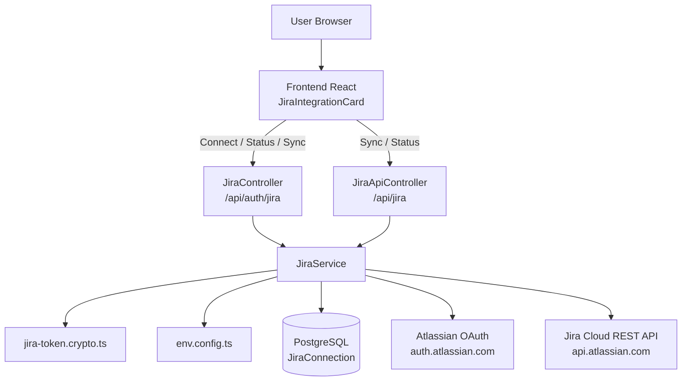
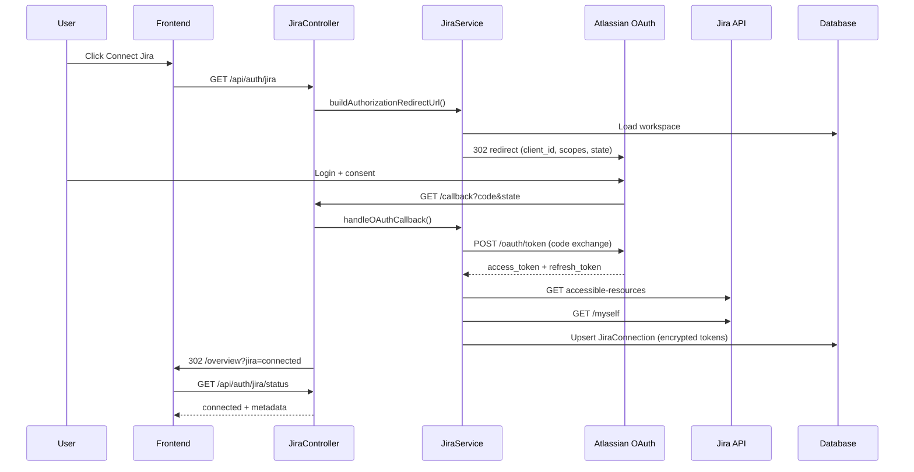

# Jira Integration Report — Pulse / TeamPulse

> **Document purpose:** Complete reference for the Jira OAuth and API integration in this project.  
> **Last verified:** August 15, 2026  
> **Important:** This document describes the **actual implementation** in the codebase. Features that do not exist are marked **NOT IMPLEMENTED**.

---

## 1. Jira Integration Overview

### What the Jira integration does

The Jira integration connects Pulse (TeamPulse) to **Atlassian Jira Cloud** using **OAuth 2.0 (3LO — three-legged OAuth)**. It allows:

1. **Connecting** an Atlassian account from the dashboard
2. **Storing** OAuth tokens securely in PostgreSQL (backend-only)
3. **Calling Jira Cloud REST APIs** from the backend (user profile, projects, issues)
4. **Synchronizing** connection health via a real API sync operation that updates **Last Sync**

### Why Jira is connected

Pulse is a Slack-first standup/check-in platform. Jira is connected so the application can eventually:

- Link standup answers to Jira issue keys (e.g. `SCRUM-6`)
- Surface assigned issues during check-ins
- Sync blocker information to Jira
- Attach Slack thread URLs to Jira issues

### How Jira relates to Standups / Check-ins

**Current status: NOT IMPLEMENTED**

There is **no code** in `check-in/`, `collection/`, or `slack/` modules that reads or writes Jira data today. Check-ins continue to work entirely through Slack DM threads and PostgreSQL `Answer` records.

The dashboard Jira card description says *"Connect Atlassian to link standup updates with Jira issues"* — that is the **intended future direction**, not current behavior.

### Features that currently depend on Jira

| Feature | Status |
|---------|--------|
| Dashboard "Jira Integration" card | **Implemented** |
| OAuth connect / disconnect | **Implemented** |
| Jira API: current user | **Implemented** |
| Jira API: projects | **Implemented** |
| Jira API: issues / my-issues | **Implemented** |
| Manual sync (`Sync Now`) | **Implemented** |
| Standup/check-in issue linking | **NOT IMPLEMENTED** |
| Automatic background Jira sync | **NOT IMPLEMENTED** |
| Jira issue UI on dashboard | **NOT IMPLEMENTED** |

---

## 2. Complete OAuth Flow

### Step-by-step flow

When the user clicks **Connect Jira** on the Overview dashboard:

```
User → Frontend → Backend → Atlassian → User consent → Callback → Token exchange → Database → Frontend
```

#### Step 1 — User clicks "Connect Jira"

- **Frontend file:** `frontend/src/components/dashboard/JiraIntegrationCard.tsx`
- **Action:** `window.location.href = '/api/auth/jira'`
- Vite dev server proxies `/api` → `http://localhost:3000`

#### Step 2 — Backend starts OAuth

- **Route:** `GET /api/auth/jira`
- **Controller:** `backend/src/jira/jira.controller.ts` → `startOAuth()`
- **Service:** `JiraService.buildAuthorizationRedirectUrl()`
  1. Loads the first Pulse `Workspace` from the database
  2. Creates a signed `state` parameter (HMAC-SHA256) containing `workspaceId`, nonce, and 10-minute expiry
  3. Builds Atlassian authorization URL using env vars:
     - `JIRA_AUTH_URL`
     - `JIRA_CLIENT_ID`
     - `JIRA_SCOPES`
     - `JIRA_REDIRECT_URI`
  4. Redirects browser to Atlassian

#### Step 3 — User authenticates at Atlassian

- User logs in and grants permissions for configured scopes
- Atlassian validates the app's callback URL matches the developer console configuration

#### Step 4 — Atlassian redirects to callback

- **Route:** `GET /api/auth/jira/callback?code=...&state=...`
- **Controller:** `JiraController.oauthCallback()`
- Validates `state` HMAC and expiry
- Rejects if user denied consent (`error` query param)

#### Step 5 — Authorization code exchange

- **Service:** `JiraService.exchangeAuthorizationCode()`
- **External API:** `POST JIRA_TOKEN_URL` (`https://auth.atlassian.com/oauth/token`)
- **Request body (JSON):**
  ```json
  {
    "grant_type": "authorization_code",
    "client_id": "<JIRA_CLIENT_ID>",
    "client_secret": "<JIRA_CLIENT_SECRET>",
    "code": "<authorization_code>",
    "redirect_uri": "<JIRA_REDIRECT_URI>"
  }
  ```
- **Receives:** `access_token`, optional `refresh_token`, `expires_in`, `scope`

#### Step 6 — Fetch Jira site and user

- **Accessible resources:** `GET {JIRA_API_URL}/oauth/token/accessible-resources`
  - Returns Jira cloud sites (`cloudId`, `name`, `url`)
- **Current user:** `GET {JIRA_API_URL}/ex/jira/{cloudId}/rest/api/3/myself`
  - Returns `accountId`, `displayName`

#### Step 7 — Store encrypted tokens in database

- **Model:** `JiraConnection` (Prisma)
- Access and refresh tokens are encrypted with AES-256-GCM before storage
- `lastSyncAt` is set to the connection time (initial sync timestamp)

#### Step 8 — Redirect back to frontend

- **Redirect URL:** `{FRONTEND_URL}/overview?jira=connected`
- Default: `http://localhost:5173/overview?jira=connected`

#### Step 9 — Frontend refreshes status

- `JiraIntegrationCard` detects `?jira=connected`
- Calls `GET /api/auth/jira/status`
- Shows **Connected** badge with user, workspace, and Last Sync

---

## 3. Environment Variables

All Jira variables are **backend-only**. None are exposed to the frontend via `VITE_*` prefixes.

| Variable | Purpose | Used in | Frontend/Backend |
|----------|---------|---------|------------------|
| `JIRA_CLIENT_ID` | Atlassian OAuth app client ID | OAuth authorize + token exchange | Backend only |
| `JIRA_CLIENT_SECRET` | Atlassian OAuth app secret | OAuth token exchange + refresh + HMAC state signing | Backend only |
| `JIRA_REDIRECT_URI` | OAuth callback URL registered in Atlassian | OAuth authorize + token exchange | Backend only |
| `JIRA_AUTH_URL` | Atlassian authorization endpoint | OAuth redirect | Backend only |
| `JIRA_TOKEN_URL` | Atlassian token endpoint | Code exchange + refresh | Backend only |
| `JIRA_API_URL` | Atlassian API base URL | Jira REST + accessible-resources | Backend only |
| `JIRA_SCOPES` | OAuth scopes requested | OAuth authorize | Backend only |
| `FRONTEND_URL` | Post-OAuth redirect target | Callback success/error redirects | Backend only |
| `JIRA_TOKEN_ENCRYPTION_KEY` | Optional separate AES key for token encryption | Token encrypt/decrypt | Backend only (optional) |

### Example values (placeholders only — never commit real secrets)

```env
JIRA_CLIENT_ID=your-atlassian-client-id
JIRA_CLIENT_SECRET=your-atlassian-client-secret
JIRA_REDIRECT_URI=http://localhost:3000/api/auth/jira/callback
JIRA_AUTH_URL=https://auth.atlassian.com/authorize
JIRA_TOKEN_URL=https://auth.atlassian.com/oauth/token
JIRA_API_URL=https://api.atlassian.com
JIRA_SCOPES=read:jira-work write:jira-work read:jira-user offline_access
FRONTEND_URL=http://localhost:5173
```

### Where `.env` lives

```
pulse/backend/.env
```

Loaded explicitly by:
- `backend/src/main.ts` (dotenv before Nest bootstrap)
- `backend/src/config/env.config.ts` (path resolution)
- `backend/src/app.module.ts` (`ConfigModule.forRoot({ envFilePath })`)

---

## 4. Jira Files

| File path | Purpose | Important symbols |
|-----------|---------|-------------------|
| `backend/src/jira/jira.module.ts` | NestJS module registration | Registers OAuth + API controllers, exports `JiraService` |
| `backend/src/jira/jira.controller.ts` | OAuth HTTP routes under `/api/auth/jira` | `startOAuth`, `oauthCallback`, `getStatus`, `disconnect`, `getConfigCheck` |
| `backend/src/jira/jira-api.controller.ts` | Jira data routes under `/api/jira` | `getStatus`, `sync`, `getCurrentUser`, `getProjects`, `getIssues`, `getMyIssues` |
| `backend/src/jira/jira.service.ts` | Core Jira business logic | OAuth, token refresh, API calls, sync, encryption |
| `backend/src/jira/jira.types.ts` | TypeScript types/DTOs | `JiraConnectionStatus`, `JiraIssueSummary`, etc. |
| `backend/src/jira/jira-token.crypto.ts` | Cryptography helpers | `encryptSecret`, `decryptSecret`, `signOAuthState`, `verifyOAuthState` |
| `backend/src/config/env.config.ts` | Env file path resolution + diagnostics | `resolveBackendEnvPath`, `getJiraEnvDiagnostics` |
| `backend/prisma/schema.prisma` | Database model | `JiraConnection` model |
| `backend/prisma/migrations/20260815180000_jira_oauth_connection/` | DB migration | Creates `JiraConnection` table |
| `frontend/src/components/dashboard/JiraIntegrationCard.tsx` | Dashboard UI | Connect, status, sync, disconnect |
| `frontend/src/pages/OverviewPage.tsx` | Dashboard page | Renders `JiraIntegrationCard` |
| `backend/src/app.module.ts` | App bootstrap | Imports `JiraModule` |

---

## 5. Backend Architecture

### Controllers

| Controller | Base path | Responsibility |
|------------|-----------|----------------|
| `JiraController` | `/api/auth/jira` | OAuth flow only — do not mix with data APIs |
| `JiraApiController` | `/api/jira` | Authenticated Jira data + sync |

### Service (`JiraService`)

Central service for all Jira operations:

| Method | Purpose |
|--------|---------|
| `buildAuthorizationRedirectUrl()` | Start OAuth |
| `handleOAuthCallback()` | Complete OAuth, store tokens |
| `getConnectionStatus()` | Dashboard connection state |
| `disconnect()` | Remove connection |
| `getCurrentJiraUser()` | Call Jira `/myself` |
| `getProjects()` | Call Jira project search |
| `getIssues()` | Search issues in accessible projects |
| `getMyIssues()` | Search issues assigned to current user |
| `syncConnection()` | Verify user + projects + my-issues, update Last Sync |
| `ensureValidAccessToken()` | Refresh token if expiring within 60 seconds |
| `refreshAccessToken()` | OAuth refresh_token grant |
| `callJiraApi()` | Generic authenticated Jira HTTP client |
| `markSynced()` | Update `lastSyncAt` after successful API call |

### OAuth handling

- HMAC-signed `state` prevents CSRF and binds OAuth to a workspace
- Tokens encrypted at rest (AES-256-GCM)
- Callback errors redirect to frontend with `?jira=error&message=...`

### Error handling

| Error | HTTP status | Behavior |
|-------|-------------|----------|
| Missing env var | 500 | `InternalServerErrorException` |
| Not connected | 404 | `NotFoundException` |
| Invalid OAuth state | 400 | `BadRequestException` |
| Jira API failure | 503 | `ServiceUnavailableException` |
| Expired token, refresh failed | 401 | `UnauthorizedException` |

---

## 6. Frontend Architecture

### Components

**`JiraIntegrationCard.tsx`** — sole Jira UI component

| UI state | How determined |
|----------|----------------|
| Loading | Initial fetch in progress |
| Connected | `GET /api/auth/jira/status` → `connected: true` |
| Not connected | Status returns `connected: false` |
| Connection error | Status API fetch failed |

| UI element | Action |
|------------|--------|
| Connect Jira | Navigate to `/api/auth/jira` |
| Manage Connection | Toggle manage panel |
| Sync Now | `POST /api/jira/sync` |
| Disconnect Jira | `DELETE /api/auth/jira` |

The frontend **never** receives OAuth tokens. It only receives connection metadata (display name, site name, timestamps).

---

## 7. Jira API Endpoints (This Project)

### OAuth endpoints (`JiraController`)

| Method | Route | Purpose | Response | Used by |
|--------|-------|---------|----------|---------|
| GET | `/api/auth/jira` | Start OAuth redirect | 302 to Atlassian | Connect Jira button |
| GET | `/api/auth/jira/callback` | OAuth callback | 302 to frontend | Atlassian redirect |
| GET | `/api/auth/jira/status` | Connection status | `{ connected, atlassianDisplayName, siteName, lastSyncAt, ... }` | Dashboard card |
| GET | `/api/auth/jira/config-check` | Safe env diagnostics (booleans only) | Env var presence flags | Developers/debugging |
| DELETE | `/api/auth/jira` | Disconnect Jira | `{ disconnected: true }` | Manage Connection |

### Data endpoints (`JiraApiController`)

| Method | Route | Purpose | Response | Used by |
|--------|-------|---------|----------|---------|
| GET | `/api/jira/status` | Same as auth status | Connection metadata | Available for API clients |
| POST | `/api/jira/sync` | Real sync (user + projects + my-issues) | `{ synced, lastSyncAt, checked }` | Sync Now button |
| GET | `/api/jira/me` | Current Jira user | `{ accountId, displayName, ... }` | Backend/testing |
| GET | `/api/jira/projects` | Accessible projects | `{ total, projects[] }` | Backend/testing |
| GET | `/api/jira/issues?maxResults=N` | Recent issues in accessible projects | `{ total, issues[] }` | Backend/testing |
| GET | `/api/jira/my-issues?maxResults=N` | Issues assigned to connected user | `{ total, issues[] }` | Backend/testing |

**Authentication:** No HTTP session guard exists in Pulse. Endpoints use the workspace's stored Jira connection (first workspace in DB). Multi-user auth is a known limitation.

---

## 8. Jira External APIs

| External API | Method | Purpose |
|--------------|--------|---------|
| `{JIRA_AUTH_URL}` | GET redirect | User authorization |
| `{JIRA_TOKEN_URL}` | POST | Code exchange + refresh |
| `{JIRA_API_URL}/oauth/token/accessible-resources` | GET | List Jira sites |
| `{JIRA_API_URL}/ex/jira/{cloudId}/rest/api/3/myself` | GET | Current user |
| `{JIRA_API_URL}/ex/jira/{cloudId}/rest/api/3/project/search` | GET | Projects |
| `{JIRA_API_URL}/ex/jira/{cloudId}/rest/api/3/search/jql` | POST | Issue search (new API) |

> **Note:** The legacy `/rest/api/3/search` endpoint returns **410 Gone**. This project uses `/rest/api/3/search/jql`.

### Example issue response shape (from this app's mapper)

```json
{
  "id": "10005",
  "key": "SCRUM-6",
  "summary": "Implement AI Report Generation",
  "status": "In Progress",
  "issueType": "Task",
  "assignee": "Example User",
  "projectKey": "SCRUM",
  "projectName": "example-project",
  "priority": "High",
  "updatedAt": "2026-08-15T16:21:59.718+0300",
  "issueUrl": "https://your-site.atlassian.net/browse/SCRUM-6"
}
```

---

## 9. Jira Issues

### How issues are retrieved

1. `JiraService.getMyIssues()` runs JQL: `assignee = currentUser() ORDER BY updated DESC`
2. `JiraService.getIssues()` first loads projects, then runs bounded JQL: `project in ("KEY1", "KEY2") ORDER BY updated DESC`
3. Results mapped by `mapIssueSummary()` with null-safe field access

### Standup/check-in connection

**NOT IMPLEMENTED**

Recommended future approach (not built yet):
- Parse issue keys from `Answer.text` in `CollectionService` after submission
- Store links in a future `JiraIssueLink` table
- Optionally show linked issues on report pages

---

## 10. Database

### `JiraConnection` model

| Field | Stored | Why |
|-------|--------|-----|
| `id` | UUID | Primary key |
| `workspaceId` | UUID | One Jira connection per Pulse workspace |
| `cloudId` | String | Atlassian cloud ID for API URLs |
| `siteName` | String | Display name on dashboard |
| `siteUrl` | String | Build issue URLs (`/browse/KEY`) |
| `atlassianAccountId` | String | Connected Atlassian account |
| `atlassianDisplayName` | String | Dashboard "Connected as" |
| `accessToken` | Encrypted string | Authenticate Jira API calls |
| `refreshToken` | Encrypted string (optional) | Refresh expired access tokens |
| `expiresAt` | DateTime (optional) | Know when to refresh |
| `scopes` | String | Granted OAuth scopes |
| `connectedAt` | DateTime | When OAuth completed |
| `lastSyncAt` | DateTime | Last successful Jira API operation |
| `updatedAt` | DateTime | Prisma auto-update |

**Verified after OAuth (August 15, 2026):**
- Access token: stored (encrypted)
- Refresh token: stored (encrypted)
- Expiration: stored
- cloudId, site, user: stored
- Tokens are **never** returned to the frontend

---

## 11. Token Management

### Access tokens

- Obtained during OAuth callback
- Encrypted with AES-256-GCM before DB storage
- Decrypted only in backend memory during API calls
- Atlassian access tokens typically expire in ~1 hour

### Refresh tokens

- Stored when `offline_access` scope is granted
- Used by `refreshAccessToken()` when `expiresAt` is within 60 seconds
- New tokens re-encrypted and saved to DB

### Token expiration behavior

1. Before API call → `ensureValidAccessToken()`
2. If expiring soon → attempt refresh
3. If refresh fails → 401, user must reconnect
4. If API returns 401 → one retry after refresh

### Protection

- Never logged
- Never sent to frontend
- Never in Git (`.env` is gitignored)

---

## 12. Jira Sync

### What triggers sync

| Trigger | Updates Last Sync? |
|---------|-------------------|
| OAuth callback (initial connect) | Yes (connection time) |
| Any successful `callJiraApi()` | Yes |
| `POST /api/jira/sync` | Yes (calls user + projects + my-issues) |
| Dashboard "Sync Now" button | Yes (via sync endpoint) |
| Automatic scheduler | **NOT IMPLEMENTED** |

### What "Last Sync" means

**Last Sync** = timestamp of the most recent **successful Jira Cloud API call** made by the backend for this connection.

It is stored in `JiraConnection.lastSyncAt` and returned by `GET /api/auth/jira/status`.

It is **not** a fake/static value — it updates on real API operations.

### Sync failure behavior

- API errors throw HTTP 503 with message
- Frontend shows error toast on sync failure
- Last Sync retains previous successful timestamp

---

## 13. Security

| Measure | Implementation |
|---------|----------------|
| `JIRA_CLIENT_SECRET` backend-only | Never in frontend code or `VITE_*` vars |
| OAuth tokens backend-only | Encrypted in PostgreSQL |
| `.env` gitignored | `pulse/.gitignore` includes `.env` and `backend/.env` |
| Safe logging | Startup logs booleans only (`JIRA_CLIENT_SECRET set: true`) |
| OAuth state HMAC | Prevents CSRF / workspace mismatch |
| Config check endpoint | Returns presence flags, never secret values |

---

## 14. Error Handling

| Error | Handling |
|-------|----------|
| Missing `JIRA_CLIENT_SECRET` | 500 — see Problems Found section |
| Invalid Client ID/Secret | Atlassian token exchange fails → redirect with error |
| Incorrect redirect URI | Atlassian rejects during authorize |
| Expired access token | Auto-refresh if refresh token exists |
| Invalid refresh token | 401 — user must reconnect |
| Jira API 410 (deprecated search) | Fixed by migrating to `/search/jql` |
| Jira API other errors | 503 Service Unavailable |
| Missing permissions | Jira API error propagated |
| Disconnected account | 404 Not Found |

---

## 15. Problems Found and Fixes

### Problem 1: `JIRA_CLIENT_SECRET is not configured`

| | |
|-|-|
| **Problem** | `GET /api/auth/jira` returned 500 even though `.env` contained Jira variables |
| **Root cause** | `ConfigModule.forRoot()` and `dotenv/config` loaded `.env` from `process.cwd()`. Depending on how the backend was started, the wrong directory was used, or a stale process lacked updated env vars. `JiraService` only read from `ConfigService`. |
| **Files affected** | `main.ts`, `app.module.ts`, new `config/env.config.ts`, `jira.service.ts` |
| **Fix** | Explicit `.env` path resolution to `pulse/backend/.env`; load dotenv before Nest bootstrap; fallback to `process.env` in `readConfig()`; startup diagnostics |
| **Why it works** | Backend always finds the correct env file regardless of startup directory |

### Problem 2: Jira issue search returned 410 Gone

| | |
|-|-|
| **Problem** | `GET /api/jira/issues` and `/my-issues` failed with 410 — deprecated `/rest/api/3/search` |
| **Root cause** | Atlassian removed legacy search endpoint (August 2025+) |
| **Files affected** | `jira.service.ts` |
| **Fix** | Migrated to `POST /rest/api/3/search/jql`; bounded JQL for project-wide search |
| **Why it works** | Uses Atlassian's current enhanced JQL search API |

### Problem 3: Last Sync only reflected OAuth connect time

| | |
|-|-|
| **Problem** | `lastSyncAt` was set on OAuth but never updated on API usage |
| **Root cause** | No sync mechanism existed beyond initial connection |
| **Files affected** | `jira.service.ts`, `JiraIntegrationCard.tsx` |
| **Fix** | `markSynced()` after every successful API call; `POST /api/jira/sync`; Sync Now button |
| **Why it works** | Last Sync now reflects real Jira API activity |

---

## 16. Testing

Tests performed on **August 15, 2026** against running backend (`localhost:3000`) with an active Jira connection.

| Test | Result |
|------|--------|
| OAuth connection (dashboard) | **PASSED** (user confirmed working) |
| Atlassian authorization redirect | **PASSED** (302 to auth.atlassian.com) |
| OAuth callback | **PASSED** (user confirmed connected state) |
| Access token retrieval | **PASSED** (stored encrypted in DB) |
| Current Jira user (`GET /api/jira/me`) | **PASSED** |
| Jira projects retrieval | **PASSED** (1 project returned) |
| Jira issues retrieval | **PASSED** (after `/search/jql` fix) |
| Assigned issues retrieval | **PASSED** (1 issue: SCRUM-6) |
| Token refresh on expiry | **NOT TESTED** (token still valid; refresh logic implemented) |
| Connection status from backend | **PASSED** (not hardcoded) |
| Jira sync (`POST /api/jira/sync`) | **PASSED** |
| Standup/check-in integration | **NOT IMPLEMENTED** |

---

## 17. Complete Flow Example

1. **User opens app** → `OverviewPage.tsx` renders `JiraIntegrationCard`
2. **Card loads status** → `GET /api/auth/jira/status` → shows Loading → Connected/Not Connected
3. **User clicks Connect Jira** → browser → `GET /api/auth/jira` → Atlassian login
4. **User grants permission** → Atlassian → `GET /api/auth/jira/callback`
5. **Backend exchanges code** → stores encrypted tokens → redirects to `/overview?jira=connected`
6. **Dashboard shows Connected** → user name, site, Last Sync from backend API
7. **User clicks Sync Now** → `POST /api/jira/sync` → backend calls Jira user/projects/issues APIs
8. **Last Sync updates** → card refreshes from `GET /api/auth/jira/status`
9. **Issues available via API** → `GET /api/jira/my-issues` (not yet shown in check-in UI)
10. **Standup usage** → **NOT IMPLEMENTED** — would require future `CollectionService` integration

---

## 18. Architecture Diagram

### Component architecture



### OAuth sequence diagram



---

## 19. Files Changed

### New files

| File | Why |
|------|-----|
| `backend/src/config/env.config.ts` | Explicit `.env` path + safe diagnostics |
| `backend/src/jira/jira-api.controller.ts` | Jira data API routes |
| `JIRA_INTEGRATION_REPORT.md` | This documentation |

### Modified files

| File | What changed | Why |
|------|--------------|-----|
| `backend/src/main.ts` | Explicit dotenv load + Jira startup logs | Fix env loading |
| `backend/src/app.module.ts` | `envFilePath` in ConfigModule | Fix env loading |
| `backend/src/jira/jira.service.ts` | API methods, refresh, sync, `/search/jql` | Enable real Jira data + sync |
| `backend/src/jira/jira.types.ts` | Issue/project/sync types | Type safety |
| `backend/src/jira/jira.module.ts` | Register `JiraApiController` | New routes |
| `frontend/src/components/dashboard/JiraIntegrationCard.tsx` | Error state, Sync Now button | Real sync + better UX |

### Unchanged (working OAuth — preserved)

| File | Note |
|------|------|
| `backend/src/jira/jira.controller.ts` | OAuth routes unchanged (only added config-check earlier) |
| `backend/src/jira/jira-token.crypto.ts` | Unchanged |
| OAuth callback flow | Preserved |

---

## 20. How to Run and Test Jira

### 1. Configure environment

Ensure `pulse/backend/.env` contains all Jira variables (see Section 3).  
Register callback URL in Atlassian Developer Console:

```
http://localhost:3000/api/auth/jira/callback
```

### 2. Start backend

```powershell
cd "c:\Users\Asus\Desktop\pules project\pulse\backend"
npm run start:dev
```

Expected startup logs:

```
Env file: ...\pulse\backend\.env (exists: true )
JIRA_CLIENT_ID set: true
JIRA_CLIENT_SECRET set: true
Application is running on: http://localhost:3000
```

### 3. Start frontend

```powershell
cd "c:\Users\Asus\Desktop\pules project\pulse\frontend"
npm run dev
```

Frontend: **http://localhost:5173/**

### 4. Connect Jira

1. Open **http://localhost:5173/overview**
2. Find **Jira Integration** card
3. Click **Connect Jira**
4. Complete Atlassian login
5. You should return to Overview with **Connected** badge

### 5. Verify connection

| Check | URL / Action | Expected |
|-------|--------------|----------|
| Env diagnostics | http://localhost:3000/api/auth/jira/config-check | All `*Set: true` |
| Connection status | http://localhost:3000/api/auth/jira/status | `"connected": true` |
| Current user | http://localhost:3000/api/jira/me | `displayName` populated |
| Projects | http://localhost:3000/api/jira/projects | `projects` array |
| My issues | http://localhost:3000/api/jira/my-issues | `issues` array with keys |
| Sync | Click **Sync Now** in Manage Connection | Toast success, Last Sync updates |

### 6. Manual configuration still required

- Atlassian OAuth app must include scopes: `read:jira-work`, `write:jira-work`, `read:jira-user`, `offline_access`
- Callback URL must exactly match `JIRA_REDIRECT_URI`
- A Slack workspace record must exist in DB (created when Slack events sync users)
- Standup/check-in Jira linking requires future development (**NOT IMPLEMENTED**)

---

## Remaining Manual Configuration

1. **Atlassian Developer Console** — verify callback URL and scopes match `.env`
2. **Multi-user auth** — Pulse has no HTTP session; Jira connection is per-workspace, not per-user
3. **Standup integration** — not built yet; requires future `CollectionService` + issue link model
4. **Token refresh live test** — implemented but not verified with an expired token in this test session

---

*End of report.*
