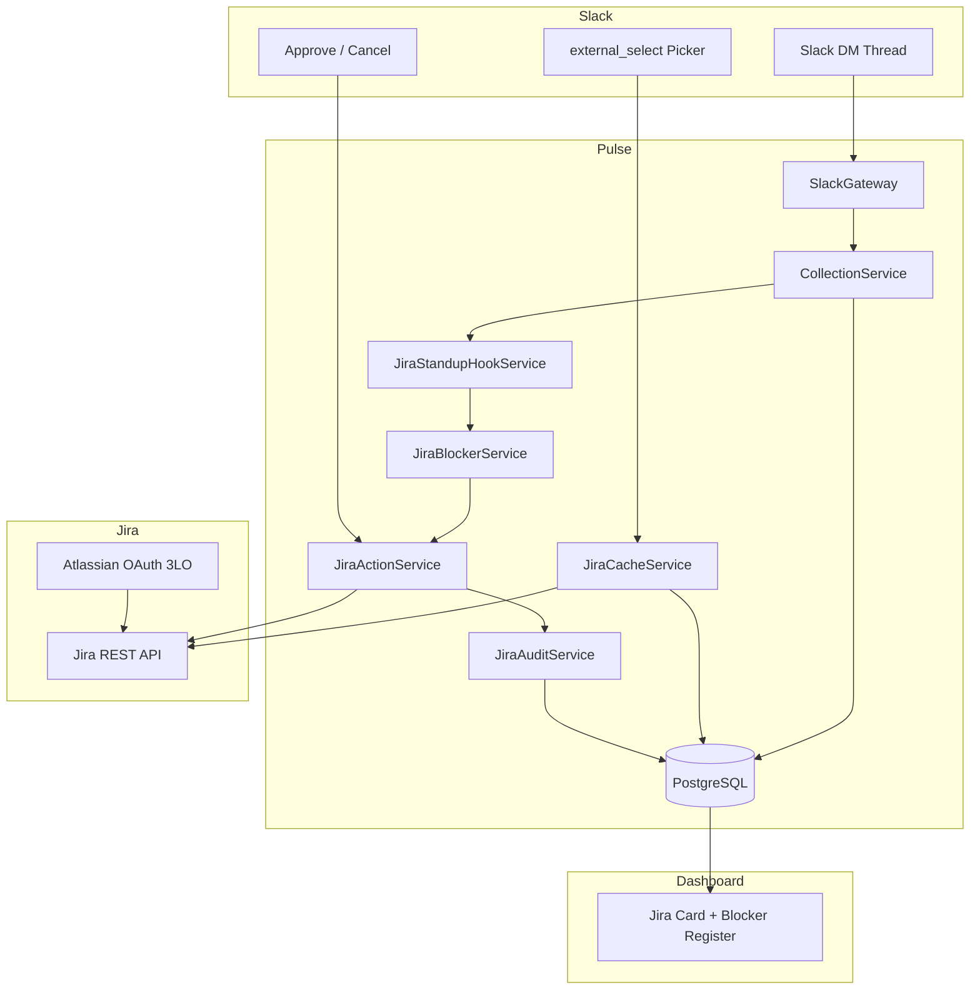
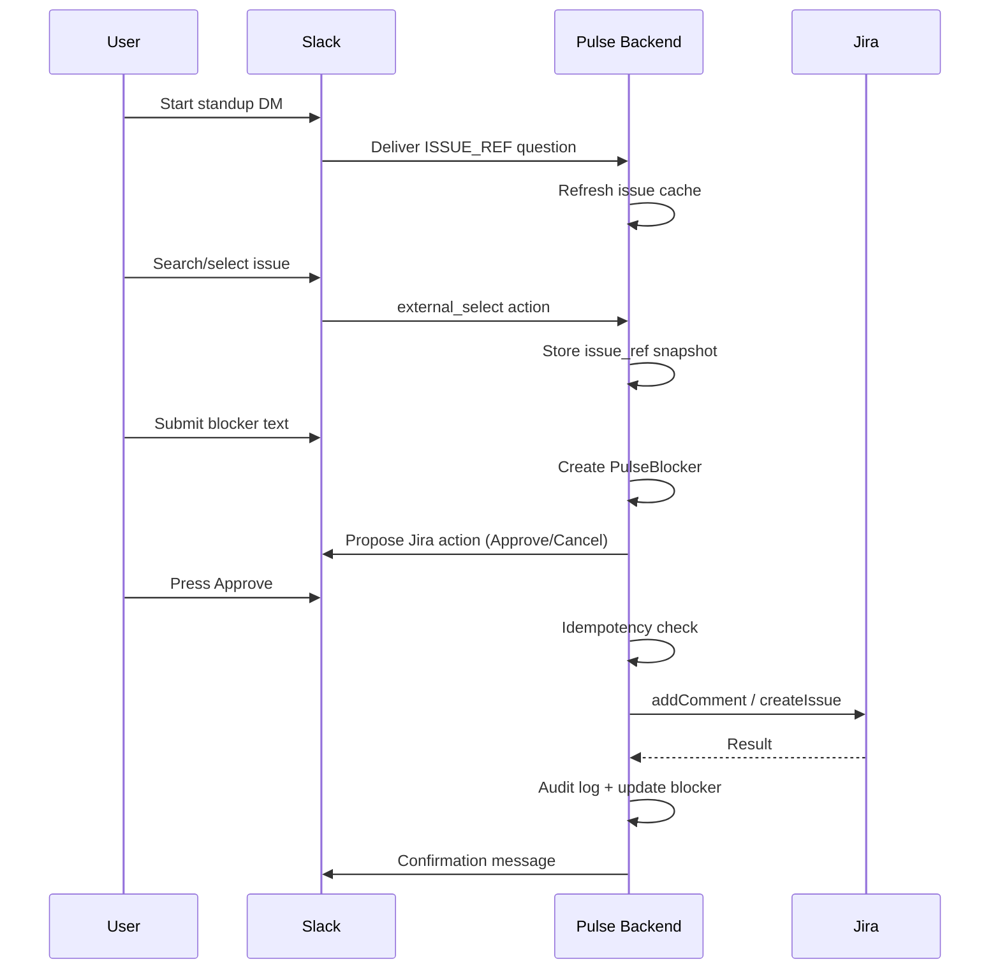

# Slack ↔ Pulse ↔ Jira Integration Report

## 1. Overview

Pulse v2 connects Slack standups/check-ins to Jira so users can answer with real Jira issues, raise durable blockers, and optionally write back to Jira — but only after explicit per-action approval.

**Architecture:**

```
Slack DM (standup/check-in)
    → Pulse backend (answers, blockers, proposals)
        → Jira OAuth + API (read/write with user permissions)
    ← Jira metadata/cache
        ← Slack picker, digest, dashboard
```

Slack is the interaction surface. Jira is the durable work-tracking system. Pulse stores structured answers and snapshots so historical reports do not require repeated Jira API calls.

---

## 2. Complete Architecture

| Component | Role |
|-----------|------|
| **Slack Bot** | DMs, Block Kit questions, `external_select` picker, Approve/Cancel buttons |
| **Pulse frontend** | Dashboard: Jira connection card, Blocker Register |
| **Pulse backend** | NestJS: collection, Slack gateway, Jira services |
| **Database** | PostgreSQL via Prisma: answers, cache, blockers, proposals, audit |
| **Jira OAuth** | Atlassian OAuth 2.0 (3LO), per-user tokens |
| **Jira API** | Issues, comments, issue creation, JQL search |
| **Jira cache** | Per-user `JiraIssueCacheEntry` for fast picker |
| **Standups / Check-ins** | Existing collection pipeline extended with `ISSUE_REF` |
| **Blockers** | `PulseBlocker` records persisted independently of digest |
| **Digest** | Enriched answer text via stored snapshots |
| **Audit log** | `JiraAuditLog` for propose/approve/execute/cancel/fail |



---

## 3. Complete User Flow

1. User connects Slack (existing workspace install).
2. User connects Jira via dashboard OAuth (`/api/auth/jira`) or Slack-initiated OAuth (`?slackUserId=U…`).
3. Pulse starts a standup/check-in run → Slack DM thread opens.
4. Question with type `ISSUE_REF` renders `external_select` (“Search your issues…”).
5. User searches/selects a real Jira issue (e.g. `SCRUM-6`).
6. Pulse stores structured `issue_ref` snapshot in `Answer.structuredValue`.
7. User submits a blocker answer → `PulseBlocker` created.
8. Pulse proposes Jira action privately in the DM thread (comment on linked issue, or create new issue).
9. **Nothing is written to Jira yet.**
10. User presses **Approve** → backend validates ownership → executes Jira write.
11. `JiraAuditLog` records the outcome.
12. Slack confirmation message posted.
13. Dashboard Blocker Register and digest show enriched Jira context.



---

## 4. Existing Functionality

**Before this task (preserved):**

- Slack Socket Mode bot, DM standup/check-in threads, Block Kit for YES/NO, scale, multiple choice
- `CollectionService` answer validation and conversation state
- Check-in scheduling, runs, reports, AI digest
- Jira OAuth (Atlassian 3LO), encrypted token storage, dashboard `JiraIntegrationCard`
- Jira API: `/api/jira/me`, `/projects`, `/issues`, `/my-issues`, `/sync`
- Dashboard overview, reports, AI analytics

**Not present before:**

- `ISSUE_REF` question type
- Per-user Jira connection (was workspace-scoped)
- Jira issue cache, Slack `external_select` picker
- Durable `PulseBlocker` table
- Propose → Approve → Execute Jira writes
- Audit log, idempotency keys
- Blocker Register UI
- Free-text Jira key enrichment

---

## 5. Changes Implemented

1. **Schema:** `ISSUE_REF` enum, per-user `JiraConnection`, cache/blocker/proposal/audit tables.
2. **Jira services:** cache, issue_ref, blocker, action, audit, standup hook.
3. **Slack:** `external_select` for `ISSUE_REF`, options handler, Approve/Cancel actions.
4. **Collection:** validate/store `issue_ref`, free-text key enrichment, enriched digest text.
5. **Dashboard:** Blocker Register card, `ISSUE_REF` in question builder.
6. **Sync:** `/api/jira/sync` now refreshes per-user issue cache.

---

## 6. Slack Implementation

| Feature | Implementation |
|---------|----------------|
| **Events / interactions** | Bolt `@slack/bolt` via Socket Mode (`SlackService`) |
| **DMs** | `SlackGateway.deliverCheckInToParticipant` opens DM thread |
| **external_select** | `slack-checkin.views.ts` → `QuestionType.ISSUE_REF` |
| **Options loading** | `JiraSlackListener` registers `app.options()` (in-process, no HTTP options URL required in Socket Mode) |
| **Issue selection** | `app.action()` on `checkin_issue_ref:{submissionId}:{questionId}` |
| **Approve / Cancel** | `jira_action_approve:` / `jira_action_cancel:` buttons |
| **Signature verification** | Bolt initialized with `SLACK_SIGNING_SECRET` |

**Source files:**

- `backend/src/slack/slack.service.ts` — Bolt app, signing secret, postMessage
- `backend/src/slack/slack.gateway.ts` — standup pipeline, Jira hooks after completion
- `backend/src/slack/slack-checkin.views.ts` — Block Kit builders, Approve/Cancel blocks
- `backend/src/slack/jira-slack.listener.ts` — picker options, issue select, approval handlers
- `backend/src/slack/slack.module.ts` — module wiring with `JiraModule`

---

## 7. Jira Implementation

| Feature | Implementation |
|---------|----------------|
| **OAuth** | Atlassian 3LO; state includes `userId` (+ optional `slackUserId`) |
| **Per-user tokens** | `JiraConnection.userId @unique`, AES-256-GCM encrypted |
| **Token refresh** | `ensureValidAccessToken` / `refreshAccessToken` in `JiraService` |
| **Issues / JQL** | `/rest/api/3/search/jql`, `getMyIssuesForUser`, `lookupIssueForUser` |
| **Cache** | `JiraCacheService` — assigned issues on refresh; JQL fallback on search |
| **Writes (approved only)** | `addCommentForUser`, `createIssueForUser` |
| **Transitions** | **Not implemented** |
| **Blocked flag/label/links** | **Not implemented** |

**Source files:**

- `backend/src/jira/jira.service.ts` — OAuth, API calls, per-user connection
- `backend/src/jira/jira.controller.ts` — `/api/auth/jira/*`
- `backend/src/jira/jira-api.controller.ts` — `/api/jira/*`
- `backend/src/jira/jira-cache.service.ts` — cache + picker search
- `backend/src/jira/jira-issue-ref.service.ts` — snapshots, free-text enrichment
- `backend/src/jira/jira-action.service.ts` — propose/approve/execute/cancel
- `backend/src/jira/jira-blocker.service.ts` — durable blockers
- `backend/src/jira/jira-audit.service.ts` — audit records
- `backend/src/jira/jira-standup-hook.service.ts` — post-submission hooks, digest formatting
- `backend/src/jira/blocker.controller.ts` — `/api/blockers`

---

## 8. Slack ↔ Jira Identity Mapping

```
Slack slackUserId  →  User.slackUserId (unique)  →  User.id
                                                      ↓
                                              JiraConnection.userId (unique)
                                                      ↓
                                              Atlassian accountId (in connection record)
```

- Mapping is **explicit via Pulse `User` record**, not email string matching.
- `JiraService.resolveUserIdFromSlack(slackUserId)` looks up `User` by Slack ID.
- OAuth initiated from Slack passes `?slackUserId=` so the token binds to the correct Pulse user.
- Dashboard OAuth (no Slack param) binds to the first workspace user (backward compatibility).
- Jira API calls use the connected user's token — permissions match Jira, not elevated.

---

## 9. issue_ref

**Question type:** `QuestionType.ISSUE_REF` (Prisma enum + question builder UI).

**Stored in:** `Answer.structuredValue` (JSON) + human-readable `Answer.text`.

**Example snapshot:**

```json
{
  "type": "issue_ref",
  "issueKey": "SCRUM-6",
  "issueId": "10005",
  "summary": "Implement AI Report Generation",
  "status": "In Progress",
  "projectKey": "SCRUM",
  "projectName": "pulse-team",
  "issueType": "Task",
  "priority": "High",
  "issueUrl": "https://your-site.atlassian.net/browse/SCRUM-6",
  "capturedAt": "2026-08-15T15:50:04.512Z"
}
```

**Display format:** `SCRUM-6 · Implement AI Report Generation · In Progress`

---

## 10. Jira Ticket Picker

```
Slack external_select
  → Bolt app.options(CHECKIN_ISSUE_REF_ACTION:…)
  → resolveUserIdFromSlack + hasUserConnection
  → jiraCacheService.refreshUserCache(userId)
  → jiraCacheService.searchPickerOptions(userId, query)
      → search local cache first
      → if no cache hits and query non-empty → live JQL fallback
  → return up to 20 options
```

**Latency control:** Cache-first; refresh on picker open; JQL only when cache miss with query. Target p95 < 1.5s — **not load-tested**.

**Graceful degradation:** If user has no Jira connection, `ISSUE_REF` questions downgrade to `FREE_TEXT` before posting (`JiraStandupHookService.prepareQuestionForDelivery`).

---

## 11. Jira Cache

| Aspect | Detail |
|--------|--------|
| **What** | Assigned/recently synced issues per user |
| **When** | On `/api/jira/sync`, picker options request, issue key resolution |
| **For whom** | Scoped by `userId` — no cross-user leakage |
| **Refresh** | `refreshUserCache` pulls up to 50 assigned issues |
| **Search fallback** | JQL `text ~ "query" ORDER BY updated DESC` |
| **Security** | `userId` filter on all queries |
| **Failure** | Returns empty options; standup continues with plain text |

**Table:** `JiraIssueCacheEntry` (unique on `userId + issueKey`).

---

## 12. Structured Issue Snapshot

Fields stored at answer time (see §9). Historical answers remain readable if Jira issue is renamed/deleted because snapshot is stored in Pulse DB.

---

## 13. Standup Flow

1. Scheduler/run starts check-in → `SlackGateway.deliverCheckInToParticipant`.
2. First question posted in DM thread (`postDmQuestionMessage` with `slackUserId` for Jira fallback).
3. User answers via buttons, `external_select`, or plain text.
4. `CollectionService.submitAnswer` validates and stores answer.
5. Next question or completion.
6. On completion: participant summary, then `JiraStandupHookService.afterSubmissionCompleted` detects blockers and sends Jira proposals.
7. Outro message posted.

---

## 14. Blocker Flow

1. Blocker detected from standup answer (question contains “blocker” or negative/blocking text).
2. `PulseBlocker` created with description, team/run/submission links, optional linked Jira issue from `issue_ref`.
3. If user has Jira connected → `proposeJiraActionForBlocker`:
   - Linked issue → propose **add comment**
   - No linked issue → propose **create issue**
4. Proposal sent privately in user's DM thread with Approve/Cancel.
5. On approve → Jira write → blocker updated with new issue key if created.

---

## 15. Approval System

```
proposed → (user Approve) → approved → executed → Slack confirmation
         → (user Cancel)  → cancelled
         → (Jira error)   → failed (audit recorded)
```

- **No automatic Jira writes.**
- Approval is action-specific (single `JiraProposedAction` row).
- No “always allow” setting.
- Only the owning user can approve/cancel.

---

## 16. Jira Write Operations

| Operation | Status | Trigger |
|-----------|--------|---------|
| Add comment to issue | **Implemented** | Blocker with linked issue + Approve |
| Create new issue | **Implemented** | Blocker without linked issue + Approve |
| Status transition | **Not implemented** | — |
| Blocked flag/label | **Not implemented** | — |
| Issue link (is blocked by) | **Not implemented** | — |

---

## 17. Idempotency

**Key format:** `jira:{actionType}:{userId}:{blockerId}:{issueRef}:v1`

Stored as unique `JiraProposedAction.idempotencyKey`. Duplicate proposals return existing action. Re-approval of non-`proposed` actions is a no-op.

**Slack retries:** Backend enforces idempotency in DB; not live-tested with triple Slack event replay.

---

## 18. Audit Log

**Table:** `JiraAuditLog`

**Recorded:** userId, proposedActionId, actionType, jiraIssueKey, status (`proposed` / `approved` / `executed` / `cancelled` / `failed`), metadata JSON, timestamp.

**Query:** `GET /api/blockers/audit/:userId`

---

## 19. Blocker Register

**API:** `GET /api/blockers` — open blockers, optional `?teamId=`

**UI:** `BlockerRegisterCard` on Overview page (`http://localhost:5173/overview`)

Shows: description, severity, age, dependency, linked Jira key/URL. Does **not** rank people or show per-person performance scores.

---

## 20. Enriched Digest

`formatAnswerForDisplay()` used in:

- `CollectionService` standup response builders
- `report-participant.utils.ts` for AI/report participant summaries

Format: `KEY · Summary · Status` instead of raw URL/plain key.

If Jira unavailable at digest time, stored snapshot is used.

---

## 21. Graceful Degradation

| Failure | Behavior |
|---------|----------|
| Jira disconnected | `ISSUE_REF` → plain text question; answers stored as text |
| Picker fails | Empty options; user can type answer |
| Jira API error on enrichment | Answer stored without structured value |
| Jira write fails | Action marked failed; audit logged; standup already complete |
| Digest | Uses snapshots; never blocked by Jira |

---

## 22. Security

- Slack/Jira secrets in `backend/.env` only — never sent to frontend.
- Bolt uses `SLACK_SIGNING_SECRET` for request verification.
- Jira tokens encrypted at rest (AES-256-GCM).
- Per-user Jira permissions enforced via user's OAuth token.
- Jira writes require explicit per-action approval.
- No tokens or secrets in this document.

---

## 23. Database Changes

**Migration:** `20260815190000_slack_jira_integration`

| Change | Why |
|--------|-----|
| `QuestionType.ISSUE_REF` | Jira issue answer type |
| `JiraConnection.userId @unique` | Per-user OAuth |
| `JiraIssueCacheEntry` | Fast picker, per-user cache |
| `PulseBlocker` | Durable blockers |
| `JiraProposedAction` | Propose/approve/execute workflow |
| `JiraAuditLog` | Audit trail |

---

## 24. API Endpoints

| Method | Route | Purpose | Auth | Source |
|--------|-------|---------|------|--------|
| GET | `/api/auth/jira` | Start OAuth | Public redirect | `jira.controller.ts` |
| GET | `/api/auth/jira/callback` | OAuth callback | Public | `jira.controller.ts` |
| GET | `/api/auth/jira/status` | Connection status | None (dev) | `jira.controller.ts` |
| DELETE | `/api/auth/jira` | Disconnect | None (dev) | `jira.controller.ts` |
| GET | `/api/jira/me` | Current Jira user | Connected user | `jira-api.controller.ts` |
| GET | `/api/jira/my-issues` | Assigned issues | Connected user | `jira-api.controller.ts` |
| POST | `/api/jira/sync` | Sync + refresh cache | Connected user | `jira-api.controller.ts` |
| GET | `/api/blockers` | List open blockers | None (dev) | `blocker.controller.ts` |
| GET | `/api/blockers/audit/:userId` | User audit log | None (dev) | `blocker.controller.ts` |

Slack interactions are handled in-process via Bolt Socket Mode (no HTTP webhook routes for picker/approve).

---

## 25. Environment Variables

Placeholders only — set in `backend/.env`:

```
SLACK_BOT_TOKEN=xoxb-...
SLACK_SIGNING_SECRET=...
SLACK_APP_TOKEN=xapp-...
SLACK_SOCKET_MODE_ENABLED=true

JIRA_CLIENT_ID=...
JIRA_CLIENT_SECRET=...
JIRA_REDIRECT_URI=http://localhost:3000/api/auth/jira/callback
JIRA_AUTH_URL=https://auth.atlassian.com/authorize
JIRA_TOKEN_URL=https://auth.atlassian.com/oauth/token
JIRA_API_URL=https://api.atlassian.com
JIRA_SCOPES=read:jira-work write:jira-work read:jira-user offline_access

FRONTEND_URL=http://localhost:5173
DATABASE_URL=postgresql://...
PORT=3000
```

---

## 26. Problems Found and Fixes

| Problem | Root Cause | File | Fix | Why It Works |
|---------|------------|------|-----|--------------|
| Nest DI failure for `JiraSlackListener` | Circular dep: `SlackGateway` ↔ `JiraSlackListener` | `jira-slack.listener.ts`, `slack.gateway.ts` | `forwardRef()` on both injections | Breaks circular constructor resolution |
| Build errors for new Prisma models | Client not regenerated after migration | `schema.prisma` | `npx prisma generate` | Client types match schema |
| ISSUE_REF picker shown without Jira | `shouldRenderIssuePicker` returned `true` for non-ISSUE_REF | `jira-standup-hook.service.ts` | Return `false` when type ≠ ISSUE_REF | Correct gating |
| First DM question missing Jira fallback | `slackUserId` not passed on parent question | `slack.gateway.ts` | Pass `slackUserId` to `postDmQuestionMessage` | Enables ISSUE_REF → FREE_TEXT downgrade |
| Empty issue cache after sync | Sync did not populate cache | `jira-api.controller.ts` | Call `refreshUserCache` after sync | Picker has data before first standup |
| TypeScript errors in Slack listener | Wrong DTO field names | `jira-slack.listener.ts` | `answer` not `rawAnswer`; `channelId` not `channel` | Matches `OutgoingMessageDto` / gateway signature |
| Prisma JSON type errors | `Record<string, unknown>` not assignable | `jira-action.service.ts`, `jira-audit.service.ts` | Cast to `Prisma.InputJsonValue` | Satisfies Prisma client types |

---

## 27. Files Changed

| Path | What changed | Why |
|------|--------------|-----|
| `backend/prisma/schema.prisma` | New models, ISSUE_REF, per-user Jira | Integration data model |
| `backend/prisma/migrations/20260815190000_slack_jira_integration/` | SQL migration | Apply schema |
| `backend/src/jira/*` | New Jira integration services | Core Jira logic |
| `backend/src/slack/jira-slack.listener.ts` | **New** — picker + approval handlers | Slack ↔ Jira UX |
| `backend/src/slack/slack-checkin.views.ts` | ISSUE_REF blocks, Approve/Cancel | Block Kit |
| `backend/src/slack/slack.gateway.ts` | Jira hooks, slackUserId on first question | End-to-end flow |
| `backend/src/slack/slack.module.ts` | Import JiraModule, register listener | Wiring |
| `backend/src/collection/collection.service.ts` | ISSUE_REF validation, enrichment, digest | Answer storage |
| `backend/src/collection/collection.module.ts` | Import JiraModule | DI for enrichment |
| `backend/src/check-in/report-participant.utils.ts` | Enriched display text | Reports/digest |
| `frontend/src/components/checkins/QuestionBuilder.tsx` | ISSUE_REF type option | Configure questions |
| `frontend/src/pages/OverviewPage.tsx` | Blocker Register layout | Dashboard |
| `frontend/src/components/dashboard/BlockerRegisterCard.tsx` | **New** — blocker UI | Blocker Register |

---

## 28. New Files

- `backend/src/jira/jira-issue-ref.types.ts`
- `backend/src/jira/jira-cache.service.ts`
- `backend/src/jira/jira-issue-ref.service.ts`
- `backend/src/jira/jira-audit.service.ts`
- `backend/src/jira/jira-blocker.service.ts`
- `backend/src/jira/jira-action.service.ts`
- `backend/src/jira/jira-standup-hook.service.ts`
- `backend/src/jira/blocker.controller.ts`
- `backend/src/slack/jira-slack.listener.ts`
- `frontend/src/components/dashboard/BlockerRegisterCard.tsx`
- `backend/prisma/migrations/20260815190000_slack_jira_integration/migration.sql`

---

## 29. Testing Results

| Capability | Result | Notes |
|------------|--------|-------|
| Jira per-user connection | **PASSED** | `GET /api/auth/jira/status` → `connected: true` |
| Jira issue retrieval | **PASSED** | `GET /api/jira/my-issues` → real `SCRUM-6` |
| Jira cache | **PASSED** | After `POST /api/jira/sync`, cache count = 1 |
| Slack external_select | **NOT TESTED** | Requires live Slack standup with ISSUE_REF question |
| Slack multi_external_select | **NOT IMPLEMENTED** | Only single-select picker |
| issue_ref storage | **NOT TESTED** | Code path implemented; no live Slack selection test |
| Issue snapshot | **NOT TESTED** | Schema + validation in place |
| Plain-text fallback | **NOT TESTED** | Code degrades ISSUE_REF → FREE_TEXT without Jira |
| Free-text Jira key extraction | **NOT TESTED** | Wired in `submitAnswer` for FREE_TEXT |
| Enriched digest | **NOT TESTED** | Formatting wired; no live digest run verified |
| Slack blocker submission | **NOT TESTED** | Requires live Slack standup |
| Blocker persistence | **PASSED** | `GET /api/blockers` → `[]` (empty but working) |
| Jira action proposal | **NOT TESTED** | Requires blocker + Jira + Slack Approve UI |
| Approval | **NOT TESTED** | Backend logic present |
| Jira comment/write | **NOT TESTED** | `addCommentForUser` / `createIssueForUser` not invoked live |
| Jira transition suggestion | **NOT IMPLEMENTED** | Out of scope for this implementation |
| New Jira issue proposal | **NOT TESTED** | Code present for create-on-approve |
| Audit record | **NOT TESTED** | Table + service present |
| Idempotency | **NOT TESTED** | Unique key in DB; no replay test |
| Blocker Register | **PASSED** | API + dashboard component render |
| Slack signature verification | **PASSED** | Bolt initialized with signing secret (existing) |

---

## 30. How to Test Manually

**Prerequisites:** Backend on `http://localhost:3000`, frontend on `http://localhost:5173`, Slack Socket Mode enabled, Jira OAuth configured.

1. **Verify Jira OAuth:** Open `http://localhost:5173/overview` → Jira card shows Connected → click Sync.
2. **Verify cache:** `curl.exe -X POST http://localhost:3000/api/jira/sync` then check DB or picker.
3. **Configure ISSUE_REF question:** Edit a check-in → add question type “Jira Issue” (e.g. “What will you work on today?”).
4. **Connect Jira for Slack user:** Visit `http://localhost:3000/api/auth/jira?slackUserId=YOUR_SLACK_USER_ID`.
5. **Start standup:** Trigger check-in run → open Slack DM thread.
6. **Picker:** ISSUE_REF question should show “Search your issues…” → select `SCRUM-6`.
7. **Blocker:** Answer blocker question with real blocker text.
8. **Proposal:** After submission, Approve/Cancel buttons appear in DM.
9. **Approve:** Press Approve → verify Jira comment/issue → Slack confirmation.
10. **Dashboard:** Overview → Blocker Register shows open blocker.
11. **Fallback test:** Disconnect Jira → start standup → verify plain-text questions still work.
12. **Idempotency:** Replay same Approve action_id (if possible) → should not duplicate write.

---

## 31. Known Limitations

**Not implemented:**

- Jira status transition suggestions
- `multi_external_select` (multiple issues per answer)
- Blocked flag/label on issues
- Issue link relationships (`is blocked by`)
- Background scheduled cache sync job (cache refreshes on sync/picker/enrichment only)
- Per-user Jira OAuth from dashboard for every team member (dashboard OAuth binds to first workspace user)
- HTTP auth on `/api/blockers` (dev-open like other endpoints)
- Live end-to-end Slack flow testing in this session

**Not tested:**

- Full Slack DM → picker → blocker → approve → Jira write chain
- Idempotency under Slack retries
- Digest output with enriched issue_ref in production channel

---

## 32. Final End-to-End Explanation

A team member receives a standup in Slack. Pulse asks questions in a DM thread. If a question accepts Jira issues, the user picks a real ticket from their connected Jira account; Pulse stores a structured snapshot, not just a URL.

If they report a blocker, Pulse saves it as a durable record — it survives beyond the daily digest. Pulse may then **suggest** a Jira action (comment or new issue) privately. Nothing happens in Jira until the user presses **Approve**. Pulse executes exactly that action, writes an audit record, and confirms in Slack. The dashboard Blocker Register and enriched digest show the result — measuring the age of **work**, not ranking people.

If Jira is down or disconnected, the standup still completes with plain text. Pulse degrades gracefully; it never blocks collection.

---

*Report generated after implementation on branch `karam3`. Backend: `pulse/backend`. Frontend: `pulse/frontend`.*
