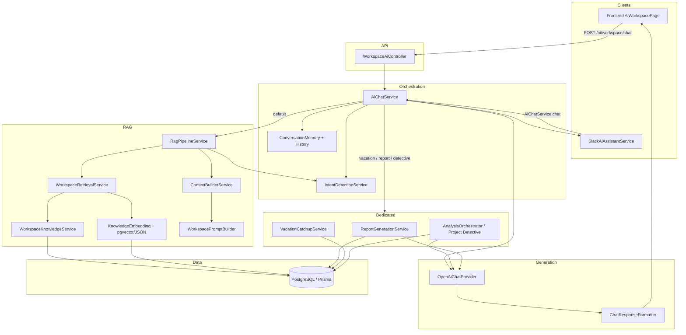

# AI Workspace Documentation

**Product:** Pulse  
**Module:** AI Workspace (RAG chat, dynamic reports, Project Detective)  
**Audience:** Engineers onboarding to the AI stack  
**Last updated:** August 19, 2026  
**Scope:** Everything implemented for the AI Workspace, plus known gaps and future ideas. This document does not replace the general Pulse tech docs; it focuses on the AI surface.

---

## 1. Project Overview

### What is the AI Workspace?

The **AI Workspace** is Pulse’s grounded Q&A and reporting layer. Users ask natural-language questions about their team’s work — standups, Jira issues, blockers, digests, and team memory — and receive answers backed by **workspace-scoped database evidence**, with citations and a confidence band.

It is not a free-form chatbot. Answers must be grounded in retrieved Pulse data for the **active workspace**. When evidence is missing, the system refuses to invent facts and returns a fixed insufficient-data message.

### What problem does it solve?

Engineering managers and ICs need a single place to ask:

- Who is blocked today?
- Why was this issue delayed?
- What happened while I was on vacation?
- Generate a weekly / sprint report
- Investigate a delay end-to-end (Project Detective)

Without AI Workspace, that knowledge is scattered across Slack standups, Jira, digests, and ad-hoc notes. The AI Workspace unifies those sources behind one conversational interface (web + Slack).

### How does it integrate with Pulse?

| Integration point | Role |
|-------------------|------|
| **PostgreSQL / Prisma** | Source of truth for standups, Jira cache, blockers, digests, memory, audits |
| **Workspace context** | `X-Workspace-Id` + `resolveActiveWorkspaceId` — same tenant isolation as Admin / Check-ins / Jira Hub |
| **OpenAI** | Optional generation (`PULSE_AI_ENABLED=true` + `OPENAI_API_KEY`); default model `gpt-4o-mini` |
| **Web UI** | Route `/ai-workspace` → `AiWorkspacePage` → `POST /api/ai/workspace/chat` |
| **Slack** | `SlackAiAssistantService` calls the same `AiChatService` for DMs / mentions |
| **Legacy digest AI** | Separate path (`AiService` / `POST /internal/ai/analyze`) for standup-run digests; shared OpenAI client/config |
| **Demo Workspace** | Seeded tenant (`T_DEMO_PULSE_WS`) for RAG / narrative testing without touching real workspaces |

---

## 2. Architecture

### High-level flow

```
Frontend (AiWorkspacePage)  or  Slack (SlackAiAssistantService)
        │
        ▼
API  WorkspaceAiController  (/ai/workspace/*)
        │
        ▼
AI Service  AiChatService  (orchestrator)
        │
        ├─ IntentDetectionService
        ├─ ConversationMemoryService
        ├─ shortcuts → Reports / Vacation / Project Detective
        └─ RagPipelineService
                │
                ├─ WorkspaceRetrievalService
                │       └─ WorkspaceKnowledgeService (Prisma collectors)
                ├─ ContextBuilderService
                └─ WorkspacePromptBuilder
                        │
                        ▼
                OpenAiChatProvider  →  OpenAI Chat Completions
                        │
                        ▼
                ChatResponseFormatter  →  answer + sources + confidence
                        │
                        ▼
                (optional) GeneratedWorkspaceReport for report / detective / vacation cards
```

### Layer responsibilities

| Layer | Primary service(s) | Responsibility |
|-------|--------------------|----------------|
| **Frontend** | `AiWorkspacePage`, `AiConversationArea`, `AiReportCard`, `report-display.util.ts` | Chat UI, suggested prompts, confidence/citations display, MD/CSV/PDF export |
| **API** | `WorkspaceAiController` | HTTP contract: health, chat, ask, reports/generate, rag/prepare |
| **AI Service** | `AiChatService` | Intent-first routing; vacation pending policy; RAG vs dedicated generators; OpenAI call; memory append |
| **Retrieval** | `WorkspaceRetrievalService`, `keyword.util.ts` | Synonym expansion, soft ranking, intent boosts (no hard source exclusion) |
| **Knowledge** | `WorkspaceKnowledgeService` | Workspace-scoped Prisma collectors → unified `KnowledgeDocument[]` + diagnostics |
| **Prompt Builder** | `WorkspacePromptBuilder` | Grounded system/user prompts; short vs deep response rules |
| **OpenAI** | `OpenAiChatProvider`, `getOpenAiClient` (`openai-client.ts`) | Chat completions when AI is enabled |
| **Response Formatter** | `ChatResponseFormatter` | Maps model text + context chunks → answer, sources, High/Medium/Low confidence |
| **Reports** | `ReportGenerationService`, `ReportMetricsService` | Deterministic metrics + optional LLM summary/recommendations |
| **Vacation** | `VacationCatchupService`, `vacation-pending.policy.ts` | Date clarification + personalized catch-up report |
| **Project Detective** | `AnalysisOrchestratorService`, analyzers, `EvidenceCollectorService`, `TimelineBuilderService`, `PatternDetectorService` | Explicit investigation / decision replay reports |

### API endpoints

Base path: **`/ai/workspace`** (proxied as `/api/ai/workspace` from the frontend).

| Method | Path | Handler | Purpose |
|--------|------|---------|---------|
| `GET` | `/ai/workspace/health` | Health + layer list + report types | Ops / debugging |
| `POST` | `/ai/workspace/chat` | `AiChatService.chat` | Production grounded chat |
| `POST` | `/ai/workspace/ask` | Same as chat | Compatibility alias |
| `POST` | `/ai/workspace/reports/generate` | `ReportGenerationService.generate` | Explicit report generation |
| `POST` | `/ai/workspace/rag/prepare` | `WorkspaceAiService.prepareRag` | RAG package only (no OpenAI) |

**Request body** (`WorkspaceAskRequest`): `workspaceId?`, `conversationId?`, `question`, `reportType?`, `focusUserName?`.

### Module wiring

- Nest module: `backend/src/ai/ai.module.ts`
- Controllers: `AiController` (legacy digests) + `WorkspaceAiController`
- Imports: `PrismaModule`, `JiraModule` (live changelog for detective when connected)
- Also used by Slack / Check-in / Scheduler for digests and Slack AI

### Configuration

| Env var | Meaning |
|---------|---------|
| `PULSE_AI_ENABLED=true` | Allow AI generation |
| `OPENAI_API_KEY` | Required with the flag above |
| `OPENAI_MODEL` | Optional; default `gpt-4o-mini` |

`isAiFeatureEnabled()` requires **both** the flag and a non-empty API key. Reports/detective/vacation can still return **metrics-only** structured reports when AI is off; pure RAG chat throws if OpenAI is unavailable.

---

## 3. Data Sources

All RAG collectors in `WorkspaceKnowledgeService.collectSnapshot` are filtered by **`workspaceId`**. Retrieval uses **keyword + ranking**, not embeddings / vector search (by design for the current phase).

### Jira Issues / Jira Issue Cache

| | |
|--|--|
| **Model** | `JiraIssueCacheEntry` |
| **Contains** | Cached issue key, summary, status, assignee, project, sprint-ish metadata, timestamps |
| **Why** | Fast, offline-friendly issue context for chat, reports, and detective without live Jira on every turn |
| **When** | RAG snapshot; report metrics; vacation catch-up; Project Detective evidence |

### Jira Audit Logs

| | |
|--|--|
| **Model** | `JiraAuditLog` |
| **Contains** | Status / assignment / other audited Jira actions tied to workspace users |
| **Why** | Timeline and “what changed” evidence for delays and investigations |
| **When** | RAG collector `jira_audit`; detective evidence / timelines |

### Standups / Submissions / Answers

| | |
|--|--|
| **Models** | `StandupSubmission`, `Answer` (+ `Question`) |
| **Contains** | Per-participant standup answers (yesterday / blockers / issue refs, etc.) |
| **Why** | Primary narrative of daily team work and blockers called out in Slack |
| **When** | RAG `slack_standups`; vacation catch-up; detective evidence; report participation metrics |

### Standup Runs

| | |
|--|--|
| **Model** | `StandupRun` |
| **Contains** | Run windows, check-in linkage, completion state |
| **Why** | Anchors “today’s standup”, sprint windows, participation counts |
| **When** | RAG `standup_runs`; report metrics; filters for submissions |

### Standup Thread Updates

| | |
|--|--|
| **Model** | `StandupThreadUpdate` |
| **Contains** | Slack channel/thread discussion summaries linked to runs |
| **Why** | Captures follow-up conversation beyond DM answers |
| **When** | RAG `slack_threads`; vacation; detective |

### Check-ins

| | |
|--|--|
| **Models** | `CheckIn`, `CheckInParticipant`, `Question` |
| **Contains** | Schedule, questions, participants |
| **Why** | Structure of who should answer what; report/personal scope |
| **When** | RAG `check_ins`; report personal/team scoping |

### Blockers / Blocker Updates

| | |
|--|--|
| **Models** | `PulseBlocker`, `PulseBlockerUpdate` |
| **Contains** | Open/resolved blockers, owners, linked issues, update history |
| **Why** | Direct answers to “who is blocked” and delay root causes |
| **When** | RAG `blockers` / `blocker_updates`; reports; vacation; detective |

### Reports / AI Digests

| | |
|--|--|
| **Model** | `AiDigest` |
| **Contains** | Stored AI (or fallback) standup digests — themes, blockers, summaries |
| **Why** | Prior synthesized team reports become searchable knowledge |
| **When** | RAG `reports`; report metrics; vacation; detective |

### Team Memory

| | |
|--|--|
| **Model** | `TeamMemoryDocument` |
| **Contains** | Indexed notes / memory documents (titles, body text, metadata) |
| **Why** | Longer-lived institutional knowledge beyond a single standup |
| **When** | RAG `team_memory`; detective; `TEAM_MEMORY_SEARCH` intent boost |

### Slack AI Chat Logs

| | |
|--|--|
| **Model** | `SlackAiChatLog` |
| **Contains** | Prior Slack ↔ AI Q&A turns |
| **Why** | Continuity and reusable prior answers; another retrieval source |
| **When** | RAG `slack_ai_chat`; written on Slack AI replies |

### Workspace / Users / Teams

| | |
|--|--|
| **Models** | `Workspace`, `User`, `Team`, `TeamMember` |
| **Contains** | Tenant boundary, member display names, team membership |
| **Why** | Isolation, name resolution (“What is Sara working on?”), personal reports |
| **When** | Every request (workspace resolve); RAG `slack_members`; user filters |

### Supporting models (less central to ranking, still AI-adjacent)

| Model | Role |
|-------|------|
| `JiraConnection` | Enables optional **live** Jira changelog in detective evidence |
| `AnswerJiraIssueLink` | Links standup answers to issue keys (demo + hub analytics) |
| `BlockerFollowUpSession` / `JiraProposedAction` | Product/demo workflows; not primary RAG ranking sources |
| `ConversationState` | Slack standup DM state machine (not AI Workspace chat memory) |
| `InboundEvent` | Webhook/event history (seeded in demo; isolation tests) |

---

## 4. AI Features Already Implemented

### AI Workspace chat

- ChatGPT-style UI at `/ai-workspace`.
- Session-scoped `conversationId` (frontend state; backend in-memory memory).
- Grounded answers with **Sources** and **High / Medium / Low** confidence.
- Default style: **concise** (prompt + `maxTokens: 450`) — 1–3 sentences for factual questions.
- Insufficient evidence → fixed message; **no hallucinated workspace facts**.

### Intent detection (rule-based)

`IntentDetectionService` scores keywords into `WorkspaceAiIntent`:

`GET_BLOCKERS`, `GET_USER_ACTIVITY`, `LIST_MEMBERS`, `SUMMARIZE_STANDUP`, `ISSUE_ANALYSIS`, `PROJECT_DETECTIVE`, `DECISION_REPLAY`, `SPRINT_REPORT`, `GENERATE_REPORT`, `VACATION_CATCHUP`, `TEAM_MEMORY_SEARCH`, `GENERAL_QA`.

Intent runs **before** vacation-pending continuation so a new unrelated question cancels stuck vacation clarification.

### Report generation

`ReportGenerationService` + `ReportMetricsService` produce `GeneratedWorkspaceReport` for:

`daily`, `weekly`, `sprint`, `blocker`, `jira`, `personal`, plus specialized `vacation_catchup`, `project_detective`, `decision_replay`.

Metrics are **deterministic from Prisma**. OpenAI only adds summary/recommendations when enabled; otherwise `provider: 'metrics-only'`.

Triggered from chat language (“generate weekly report”) or `POST /ai/workspace/reports/generate`.

### Project Detective & Decision Replay

See **§7**. Explicit investigation language only; simple “Why was SCRUM-8 delayed?” stays in short `ISSUE_ANALYSIS` / RAG chat.

### Root cause analysis

Part of Project Detective: evidence → timeline → pattern detection → root-cause / decision sections in a structured markdown report.

### Confidence score

`ChatResponseFormatter.computeConfidence` combines:

- intent confidence score  
- retrieved chunk count  
- distinct source types  

Bands: **High** (≥ 0.72), **Medium** (≥ 0.4), else **Low**. Reports/detective attach their own report-level confidence.

### Sources section

Each RAG answer lists cited chunks (label, title, date, URL when available). Report cards expose `sourcesUsed`.

### Export PDF / Markdown / CSV

Client-side in `AiReportCard` + `report-display.util.ts`:

- **Markdown** — download `.md`  
- **CSV** — flattened sections/metrics  
- **PDF** — print-ready window / Save as PDF (with `.txt` fallback)

### Send to Slack

- **Web UI button:** placeholder — “Send to Slack coming soon”.
- **Slack AI assistant:** long reports may be uploaded as `.md` via `SlackService.uploadTextFile` when over size thresholds (implemented for Slack-originated chats).

### Workspace isolation & multi-workspace

- All collectors filter by `workspaceId`.
- Frontend sends `X-Workspace-Id`; AI also accepts `workspaceId` in the body.
- `ConversationMemoryService` refuses cross-workspace session reuse.
- Demo seed only deletes/recreates `T_DEMO_PULSE_WS`.
- Verification helper: `backend/scripts/verify-workspace-isolation.ts`.

### Demo Workspace

Fully seeded narrative tenant for RAG / detective demos (see **§5**).

### Slack AI bridge

`SlackAiAssistantService` maps Slack user → workspace, personalizes first-person phrasing, calls `AiChatService.chat`, persists `SlackAiChatLog`, maps threads → `conversationId`.

### Vacation catch-up

Natural language (“catch me up on my vacation”) → date clarification when needed → `VacationCatchupService` personalized report. Pending state only continues on **date-like** replies (`vacation-pending.policy.ts`).

### Response-depth policy

Simple factual / “why delayed?” questions → short chat. Full detective sections only on **explicit** investigation phrases (`isExplicitDetectiveRequest`). Covered by `response-depth.spec.ts` and `npm run test:ai-retrieval`.

### Legacy standup digest AI

Still present: `AiService` + `POST /internal/ai/analyze` for check-in digests, with rules fallback and evaluation baseline. Separate from Workspace RAG but shares OpenAI config.

---

## 5. Demo Workspace

### Why we created it

Real Pulse / TeamPulse workspaces must not be polluted with synthetic RAG scenarios. Demo Workspace provides a **safe, reproducible, cross-linked dataset** (SCRUM-8 OAuth delay, Nora PTO, Sprint 14) for AI demos and regression testing.

### How it works

- Same `Workspace` schema and the **same runtime services** as any tenant.
- **No** `if (demo)` branches in AI code.
- Identified solely by fixed Slack id: **`T_DEMO_PULSE_WS`**.
- Switch via TopNav workspace selector (stores id → `X-Workspace-Id`).

### How it differs from a real workspace

| | Demo | Real |
|--|------|------|
| Identity | `T_DEMO_PULSE_WS` | Customer Slack workspace ids |
| Data volume | Dense synthetic narrative | Organic production volume |
| Jira site | `https://demo.atlassian.net` (seeded cache) | Live Atlassian site via OAuth |
| Safety | Seed/remove only this tenant | Never touched by demo scripts |

### Where demo data lives

| Path | Role |
|------|------|
| `backend/prisma/demo/data.ts` | Members, teams, issues, blockers, standup text, memory, chats |
| `backend/prisma/seed-demo.ts` | Idempotent insert (delete demo only, then recreate) |
| `backend/prisma/remove-demo.ts` | Demo-only delete |
| `backend/prisma/demo/README.md` | Operator guide |
| `backend/prisma/demo/DEMO_DATA_SUMMARY.md` | Volume + narrative detail |

### Volumes (approximate)

1 workspace · 7 members · 2 teams · 40 issues · 280 cache rows · 50 runs/digests · **310** submissions · 30 blockers · 100 Slack AI chats · 128+ team memory · 330+ Jira audits · plus follow-ups, proposed actions, inbound events, answer↔issue links.

**Roster:** Layla (Tech Lead), Sara (Frontend), Nora (Backend), Mariam (Full Stack), Reem (QA), Haya (DevOps), Joud (UI/UX).

### Commands

```bash
cd pulse/backend

# Create or regenerate (safe — only deletes T_DEMO_PULSE_WS)
npm run seed:demo

# Delete Demo Workspace only
npm run seed:demo:remove
```

After schema changes: stop Nest on Windows if needed, then `npx prisma generate`.

---

## 6. AI Request Lifecycle

Step-by-step after the user asks a question (primary path: `AiChatService.chat`):

```
User Question
      ↓
Workspace Resolution   (body workspaceId / X-Workspace-Id / active workspace)
      ↓
Session Load           (ConversationMemoryService.getOrCreate)
      ↓
Intent Detection       (IntentDetectionService — always first)
      ↓
Vacation Pending?      (continue only if date-like; else clear pending)
      ↓
Dedicated Route?
  ├─ VACATION_CATCHUP     → VacationCatchupService → report response
  ├─ PROJECT_DETECTIVE /
  │  DECISION_REPLAY      → AnalysisOrchestrator → detective report
  └─ GENERATE_REPORT /
     SPRINT_REPORT        → ReportGenerationService → report response
      ↓ (else)
RAG Pipeline
  Intent → Retrieval (knowledge snapshot + rank)
        → Context (chunk cap)
        → Prompt Builder
      ↓
Post-RAG re-check      (may still divert to report / vacation / detective)
      ↓
Evidence?
  No  → insufficient-data message (no OpenAI)
  Yes → OpenAI Chat Completions (temp 0.15, maxTokens 450)
      ↓
ChatResponseFormatter  (answer + sources + confidence)
      ↓
Append assistant turn to memory
      ↓
AiChatResponse → Frontend / Slack
```

### Important behavioral rules

1. **Intent before vacation pending** — prevents stuck “please provide dates” loops when the user changes topic.  
2. **Soft retrieval** — intent boosts preferred entity types; it does **not** hard-exclude other sources.  
3. **Response depth** — full detective only on explicit investigation language.  
4. **Empty context** — no OpenAI call; return `NO_WORKSPACE_INFO_MESSAGE`.

---

## 7. Project Detective

### When it is triggered

Only when the user **explicitly** asks for investigation-depth analysis. Examples (`isExplicitDetectiveRequest`):

- “investigate SCRUM-8”
- “root cause analysis for SCRUM-8”
- “analyze why SCRUM-8 was delayed”
- “full analysis of sprint 14”
- “detective mode” / “project detective”
- “explain the timeline …”
- “what went wrong …”

**Not** triggered by: “Why was SCRUM-8 delayed?”, “Who is assigned to SCRUM-8?”, status / workload questions — those stay in concise RAG chat (`ISSUE_ANALYSIS` / `GENERAL_QA`).

**Decision Replay** triggers on phrases like “replay”, “decision replay”, “replay sprint …”.

Routing: `AnalysisOrchestratorService` → `ProjectDetectiveAnalyzer` or `DecisionReplayAnalyzer`.

### Pipeline inside detective

1. **Focus resolution** — issue key, user name, sprint, mode (`timeline` / `pattern` / `decision_replay`).  
2. **Evidence collection** (`EvidenceCollectorService`) — ~60-day lookback from:
   - standup submissions  
   - blockers + updates  
   - Jira issue cache  
   - digests  
   - team memory  
   - thread updates  
   - optional **live Jira changelog** via `JiraService` when connected  
3. **Timeline generation** (`TimelineBuilderService`) — ordered dated events.  
4. **Pattern detection** (`PatternDetectorService`) — repeated blockers, ownership/delay patterns.  
5. **Root cause / decision sections** — structured markdown (Focus, Timeline, Patterns, Root Causes or Decisions, Sources, Confidence).  
6. **Optional OpenAI polish** — narrative when AI enabled; otherwise metrics/evidence-only report.  
7. **Confidence** — report-level band based on evidence density / analyzer heuristics.  
8. **Recommendations** — included in the structured report sections when generation succeeds.

Returned as `GeneratedWorkspaceReport` with `reportType` `project_detective` or `decision_replay`, rendered by `AiReportCard`.

---

## 8. Database Models

Models the AI reads (and in some cases writes). Purpose · relationships · where queried.

| Model | Purpose for AI | Relationships (high level) | Queried by |
|-------|----------------|----------------------------|------------|
| `Workspace` | Tenant boundary | Users, teams, Jira connections, inbound events | Workspace resolve; all collectors |
| `User` | Member identity / names | Workspace; submissions; blockers; Slack AI logs | Knowledge users; name resolve; Slack AI |
| `Team` / `TeamMember` | Team scope | Workspace; check-ins; members | Reports; personal filters |
| `CheckIn` / `Question` / `CheckInParticipant` | Standup definition | Team; runs; answers | Knowledge check-ins; reports |
| `StandupRun` | Run window | CheckIn; submissions; digests | Knowledge; metrics |
| `StandupSubmission` / `Answer` | Standup evidence | User; run; questions | RAG; vacation; detective; metrics |
| `AiDigest` | Stored digests as “reports” knowledge | Run / check-in | RAG reports; vacation; detective; metrics |
| `StandupThreadUpdate` | Thread discussion | Run / workspace users | RAG threads; vacation; detective |
| `JiraIssueCacheEntry` | Cached issues | Workspace / user context | RAG jira; reports; detective |
| `JiraAuditLog` | Issue change history | Workspace users | RAG jira_audit; timelines |
| `JiraConnection` | Live Jira auth | Workspace / user | Optional detective changelog |
| `PulseBlocker` / `PulseBlockerUpdate` | Blocker state & history | User; optional issue | RAG; reports; vacation; detective |
| `TeamMemoryDocument` | Indexed memory | Workspace | RAG team_memory; detective |
| `SlackAiChatLog` | Durable Slack AI Q&A | User / workspace | RAG slack_ai_chat; written by Slack AI |
| `AnswerJiraIssueLink` | Answer ↔ issue | Answer; user; run | Hub analytics; demo volume |
| `BlockerFollowUpSession` / `JiraProposedAction` | Follow-up / action workflows | Blockers / Jira | Product flows; demo seed |
| `ConversationState` | Standup DM state | User | Standup bot (not Workspace chat) |
| `InboundEvent` | Inbound webhook log | Workspace | Demo / isolation tests |

**Not persisted:** AI Workspace conversation turns live in **`ConversationMemoryService` (in-process Map)**. Restart clears history; multi-instance deploys do not share sessions.

---

## 9. Current Limitations

| Area | Limitation |
|------|------------|
| **Vector backend** | Local Postgres may lack pgvector — JSON cosine fallback is used automatically |
| **Intent** | Deterministic regex/keyword scoring — brittle on novel phrasing |
| **Confidence** | Heuristic bands — not calibrated probability |
| **Context caps** | ~18 chunks / ~12k chars — long investigations may drop evidence |
| **Detective lookback** | Evidence collector defaults to ~60 days |
| **Soft ranking** | Tangential sources can still appear (by design vs hard filters) |
| **Dual AI stacks** | Legacy digest `AiService` vs Workspace RAG — overlapping concepts, separate prompts |
| **OpenAI dependency** | Pure chat requires API key; reports degrade to metrics-only |
| **Live Jira** | Detective changelog enrichment only when connection exists |
| **Eval scoring** | Deterministic heuristics (stable regression), not LLM-as-judge |

---

## 10. Future Ideas

Ideas discussed for the AI roadmap (mix of partially started vs not started):

| Idea | Status notes |
|------|----------------|
| **AI Project Detective** | **Implemented** (explicit trigger); deepen evidence quality & UX |
| **AI Decision Replay** | **Implemented** as sibling analyzer; expand sprint-level storytelling |
| **Vacation Summary / Catch-up** | **Implemented**; improve date UX and multi-absence ranges |
| **Executive Reports** | **Implemented** |
| **Persisted conversations** | **Implemented** (Postgres + history UI + search) |
| **Semantic / vector search** | **Implemented** (hybrid + pgvector-ready JSON fallback) |
| **Send report to Slack (web)** | **Implemented** |
| **Golden evaluation suite** | **Implemented** (dashboard + exports) |
| **Better follow-ups** | Multi-turn clarification beyond vacation dates |
| **Calibrated confidence** | Train/evaluate confidence against labeled answers |
| **Unified AI platform** | Merge digest + workspace prompting/eval under one framework |
| **Native pgvector in prod** | Install extension on Postgres host; auto-detect already wired |

---

## 11. Important Files

| File | Purpose |
|------|---------|
| `backend/src/ai/ai.module.ts` | Nest module wiring for legacy + workspace AI |
| `backend/src/ai/ai.config.ts` | Feature flag, model, eval baseline |
| `backend/src/ai/openai-client.ts` | Shared OpenAI SDK client |
| `backend/src/ai/ai.service.ts` | Legacy standup digest generation |
| `backend/src/ai/ai.controller.ts` | `POST /internal/ai/analyze` |
| `backend/src/ai/workspace/workspace-ai.controller.ts` | Workspace HTTP API |
| `backend/src/ai/workspace/workspace-ai.service.ts` | RAG prepare façade (no generation) |
| `backend/src/ai/workspace/chat/ai-chat.service.ts` | Main chat orchestrator |
| `backend/src/ai/workspace/rag/rag-pipeline.service.ts` | Intent → retrieval → context → prompt |
| `backend/src/ai/workspace/knowledge/workspace-knowledge.service.ts` | Prisma collectors + diagnostics |
| `backend/src/ai/workspace/retrieval/workspace-retrieval.service.ts` | Hybrid keyword + semantic ranking |
| `backend/src/ai/workspace/retrieval/knowledge-embedding.service.ts` | Embedding index + semantic search |
| `backend/src/ai/workspace/retrieval/pgvector-support.service.ts` | pgvector detect / ANN / fallback |
| `backend/src/ai/workspace/retrieval/embedding-reindex.service.ts` | Background reindex |
| `backend/src/ai/workspace/memory/conversation-memory.service.ts` | Persist turns + L1 cache |
| `backend/src/ai/workspace/memory/conversation-history.service.ts` | List / search / reopen / delete |
| `backend/src/ai/workspace/slack/ai-slack-export.service.ts` | Send to Slack |
| `backend/src/ai/workspace/evaluation/*` | Gold dataset, runner, dashboard API |
| `frontend/src/pages/AiWorkspacePage.tsx` | AI Workspace page |
| `frontend/src/pages/AiEvaluationPage.tsx` | Evaluation dashboard |
| `frontend/src/components/ai-workspace/*` | Chat UI, history, Slack dialog, report card |

---

## 12. Current TODO

Checklist of work still pending or incomplete:

- [ ] Install/enable **pgvector** on production Postgres (auto-detect already implemented)
- [ ] Calibrate / improve confidence scoring on production traces
- [ ] Expand gold evaluation dataset from real failures
- [ ] Optional LLM-assisted intent when rule scores are ambiguous
- [ ] Cap embedding table growth / archival for very large tenants
- [ ] Wire web auth `userId` into conversation ownership
- [ ] Optional: raise context caps carefully for long detective runs
- [ ] Deeper live Jira enrichment when OAuth is connected
- [ ] Unify legacy digest AI and Workspace RAG prompting under one framework

---

## 13. Flow Diagram



---

## 14. Summary

Pulse’s **AI Workspace** is a production-oriented, **workspace-isolated RAG system** plus specialized report generators, conversation history, Slack export, evaluation, and hybrid vector search (pgvector-ready). It sits on the same Prisma tenant data as standups, Jira cache, blockers, digests, and team memory. Users ask questions from the web UI or Slack; `AiChatService` detects intent, optionally routes to vacation catch-up, dynamic reports, or Project Detective / Decision Replay, otherwise runs hybrid retrieval, builds a grounded prompt, calls OpenAI when configured, and returns a concise answer with **sources** and a **confidence** band.

Design choices that define the current product:

- **Grounding over creativity** — insufficient evidence refuses to invent facts.  
- **Short answers by default** — ChatGPT-like brevity; full detective only on explicit investigation language.  
- **Soft retrieval** — boost relevant sources without hard-excluding others.  
- **Deterministic report metrics** — LLM is optional polish, not the source of counts.  
- **Demo Workspace** — dense narrative seed for safe end-to-end AI demos.  
- **pgvector optional** — native ANN when available; JSON cosine otherwise.

For a new developer: start at `workspace-ai.controller.ts` and `chat/ai-chat.service.ts`, then follow retrieval → prompt → OpenAI → formatter. Use Demo Workspace (`npm run seed:demo`) and `GET /ai/workspace/health` to verify the stack. Phase reports live under `docs/AI_*_REPORT.md`.
