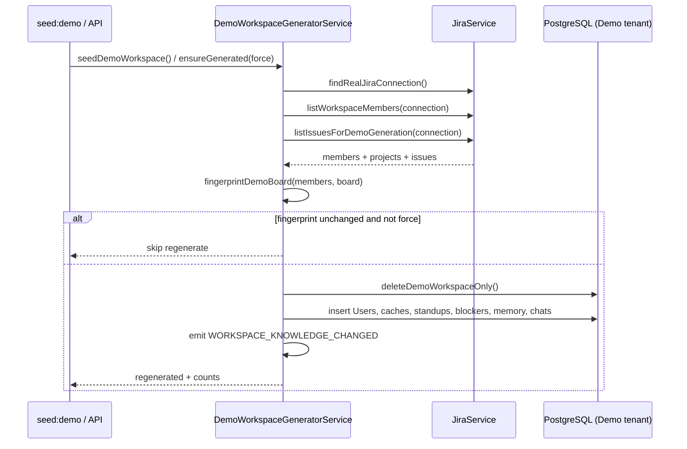

# Demo Generation Architecture

**Product:** Pulse  
**Date:** 2026-08-20  
**Scope:** Data-driven Demo Workspace seeded from Live Jira

---

## Architecture

Demo is a normal PostgreSQL tenant (`slackWorkspaceId = T_DEMO_PULSE_WS`) in the **same schema** as Real. Generation is the only special path; runtime AI/UI filter only by `workspaceId`.

```
Live Jira (read-only)
  ├─ listWorkspaceMembers()
  ├─ getProjectsForConnection()
  └─ listIssuesForDemoGeneration()  // real keys, summaries, statuses, assignees
           │
           ▼
DemoWorkspaceGeneratorService.ensureGenerated()
           │
           ├─ fingerprint(members + projects + issues)
           ├─ deleteDemoWorkspaceOnly()   // Demo rows only
           └─ buildDemoWorkspaceFromJiraMembers(members, liveBoard)
                    │
                    ├─ Users / SlackMemberCache / JiraMemberCache  ← real people
                    ├─ JiraIssueCacheEntry                         ← real issues
                    └─ Standups / Blockers / Memory / Reports / AI chats
                         (synthetic text, rewritten onto real issue keys)
```

---

## Data flow



---

## Source hierarchy

| Priority | Source | Used for |
|----------|--------|----------|
| 1 | **Live Jira members** | Display names, accountIds, emails/avatars |
| 2 | **Live Jira issues** | Issue keys, summaries, status, type, priority, assignees, project, URLs |
| 3 | **Live Jira projects** | Project key/name on cache rows + fingerprint |
| 4 | Synthetic templates | Slack standups, Team Memory, AI Reports, Blocker narratives, AI Conversations |

Boards / Sprints Agile APIs are not required for v1; sprint labels in digests stay synthetic labels tied to Live issue statuses.

---

## Generation rules

1. **Do not invent people** — roster from `listWorkspaceMembers`.
2. **Do not invent issue keys or summaries** — from Live search when available.
3. **Assignees** — map by `assigneeAccountId` → Demo user; else deterministic slot.
4. **Synthetic docs** may use legacy `SCRUM-8` / `SCRUM-12` placeholders in templates; `rewriteDemoIssueKeys` + `bindDemoIssueAliases` remaps them onto Live hero/dependency/leadership keys.
5. **Deterministic** — no `Math.random`; day offsets from `deterministicDayOffset(issueKey)`.
6. **Same board twice → same fingerprint → skip** (unless `force` / `seed:demo`).
7. **Never write to Atlassian**; never touch Real `workspaceId` rows.
8. Demo OAuth/Slack tokens remain placeholders (non-usable).

---

## Tables written

| Table | Source |
|-------|--------|
| Workspace | Demo constants |
| User, SlackMemberCache, JiraMemberCache | Live members |
| Team, TeamMember, SlackChannel, CheckIn, Question, CheckInParticipant | Synthetic structure + real people |
| JiraConnection | Fake Demo tokens (≤3 users) |
| **JiraIssueCacheEntry** | **Live issues** (fallback templates only if Live empty) |
| JiraAuditLog | Synthetic status narrative on Live keys |
| StandupRun / Submission / Answer / ConversationState / AnswerJiraIssueLink / StandupThreadUpdate | Synthetic standups referencing Live keys |
| AiDigest | Synthetic reports |
| PulseBlocker / PulseBlockerUpdate | Synthetic blockers linked to Live keys |
| TeamMemoryDocument | Synthetic + fingerprint doc |
| AiConversation (+ messages), SlackAiChatLog, InboundEvent | Synthetic Q&A on Live keys |

---

## Files modified

| File | Role |
|------|------|
| `src/jira/jira.service.ts` | `listIssuesForDemoGeneration` |
| `src/demo/demo-live-board.ts` | **New** fingerprint, aliases, rewrite helpers |
| `src/demo/demo-workspace-builder.ts` | Live issue cache + key rewrite |
| `src/demo/demo-workspace-generator.service.ts` | Fetch board; fingerprint members+issues |
| `docs/DEMO_GENERATION_ARCHITECTURE.md` | This doc |

---

## Sequence diagram (summary)

```
seed:demo
  → list members (Live)
  → list issues/projects (Live)
  → hash fingerprint
  → wipe Demo tenant only
  → insert real people + real issues into Demo workspaceId
  → insert synthetic Slack/Memory/Reports/Blockers/Chats
       rewriting SCRUM-* placeholders → Live keys
  → reindex embeddings event
```

---

## Validation

1. Connect Real Jira.
2. `npm run seed:demo` twice with unchanged board → second run skips (same fingerprint).
3. Demo Jira Hub / AI questions about a Live issue key (e.g. real `PROJ-12`) resolve from Demo cache.
4. Demo blocker/memory text references those Live keys, not invented `SCRUM-*` when Live data exists.
5. Real workspace row counts unchanged after seed.
