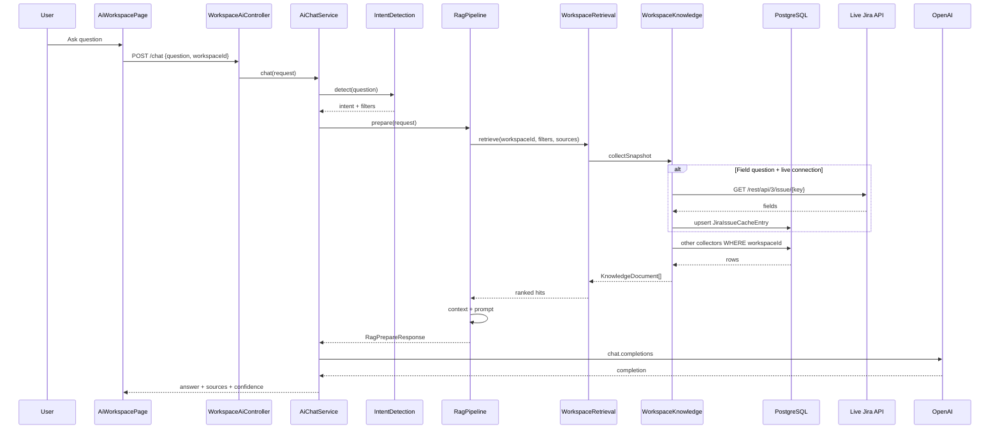
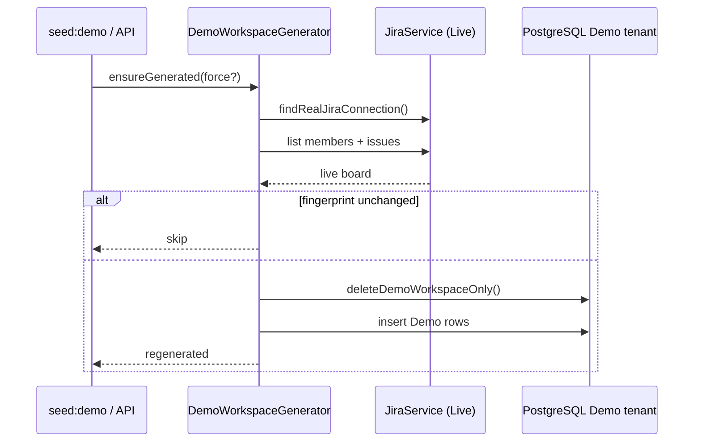

# Pulse AI Technical Guide

**Product:** Pulse (Team Pulse / Pulse V2)  
**Document:** `PULSE_AI_TECHNICAL_GUIDE.md`  
**Audience:** Senior engineers joining AI Workspace development  
**Last updated:** 2026-08-20  
**Status:** Canonical onboarding reference for the AI Workspace stack  

This guide is the **single source of truth** for understanding how Pulse AI Workspace works: NestJS, PostgreSQL/Prisma, Jira/Slack, Demo generation, multi-source RAG, workspace isolation, and OpenAI. Prefer this document for architecture; prefer **code** when this doc and the repository disagree.

**Related deep-dives**

| Document | Focus |
|----------|--------|
| [AI_SYSTEM_ARCHITECTURE.md](./AI_SYSTEM_ARCHITECTURE.md) | Broader AI + platform notes |
| [AI_WORKSPACE_DOCUMENTATION.md](./AI_WORKSPACE_DOCUMENTATION.md) | Earlier AI Workspace notes |
| [DEMO_GENERATION_ARCHITECTURE.md](./DEMO_GENERATION_ARCHITECTURE.md) | Live-Jira → Demo seeding |
| [JIRA_LIVE_SOURCE_DEBUG_REPORT.md](./JIRA_LIVE_SOURCE_DEBUG_REPORT.md) | Live-only field questions |
| [WORKSPACE_JIRA_ROUTING_REPORT.md](./WORKSPACE_JIRA_ROUTING_REPORT.md) | Per-workspace Jira OAuth |
| [BLOCKERS_DATA_CONSISTENCY_REPORT.md](./BLOCKERS_DATA_CONSISTENCY_REPORT.md) | AI vs Blockers page |
| [AI_RETRIEVAL_REFACTOR_REPORT.md](./AI_RETRIEVAL_REFACTOR_REPORT.md) | Multi-source RAG |

---

# 1. Project Overview

## 1.1 What Pulse is

**Pulse** is a production standup and team-intelligence platform. Managers configure check-ins (schedules, questions, participants, reminders, reports) from a web dashboard. Pulse:

1. Sends scheduled Slack DMs to participants  
2. Collects answers one question at a time  
3. Stores submissions, blockers, and digests in **PostgreSQL**  
4. Optionally links answers to **Jira** issues  
5. Surfaces that knowledge in Admin, Jira Hub, Reports, and **AI Workspace**

Pulse is **multi-tenant**: every meaningful row belongs to a **Workspace** (directly via `workspaceId`, or indirectly via User / Team / Run).

## 1.2 What AI Workspace does

The **AI Workspace** is Pulse’s grounded Q&A and reporting layer. Users ask natural-language questions about their team’s work and receive answers backed by **workspace-scoped evidence**, with citations and a confidence band.

Typical questions:

- Who is blocked today?  
- Who is assigned to SCRUM-9?  
- What is the status / priority of SCRUM-9?  
- Why was SCRUM-8 delayed?  
- Summarize yesterday’s standup  
- What happened while I was on vacation?  
- Generate a weekly / sprint / executive report  
- List Slack / Jira members  
- Investigate a delay (Project Detective)

Surfaces:

| Surface | Entry |
|---------|--------|
| Web | `/ai-workspace` → `AiWorkspacePage` → `POST /api/ai/workspace/chat` |
| Slack | App mention or idle DM → `SlackAiAssistantService` → same `AiChatService` |

AI Workspace is **not** a free-form chatbot. When evidence is missing, it refuses to invent facts.

## 1.3 Technologies

| Layer | Stack |
|-------|--------|
| Frontend | React, Vite, TypeScript, React Router |
| Backend | NestJS, TypeScript |
| Database | PostgreSQL |
| ORM | Prisma |
| LLM | OpenAI Chat Completions (`gpt-4o-mini` default) |
| Embeddings | OpenAI (`text-embedding-3-small`); optional pgvector |
| Integrations | Slack Bolt / Socket Mode, Atlassian Jira OAuth 2.0 (3LO) |
| Auth context | `X-Workspace-Id` header + AsyncLocalStorage |

## 1.4 High-level architecture

```
┌──────────────┐     ┌──────────────┐
│  Web UI      │     │  Slack App   │
│ /ai-workspace│     │ mention / DM │
└──────┬───────┘     └──────┬───────┘
       │                    │
       └─────────┬──────────┘
                 ▼
       ┌─────────────────────┐
       │ NestJS API          │
       │ WorkspaceAiController│
       │ SlackAiAssistant    │
       └──────────┬──────────┘
                  ▼
       ┌─────────────────────┐
       │ AiChatService       │
       │ Intent → RAG /      │
       │ Reports / Detective │
       └──────────┬──────────┘
                  ▼
       ┌─────────────────────┐
       │ Prisma + PostgreSQL │
       │ (workspace-scoped)  │
       └──────────┬──────────┘
                  │
       ┌──────────┴──────────┐
       ▼                     ▼
┌─────────────┐      ┌──────────────┐
│ Live Jira   │      │ Live Slack   │
│ (Real only) │      │ (Real only)  │
└─────────────┘      └──────────────┘
                  │
                  ▼
           ┌─────────────┐
           │ OpenAI API  │
           │ Chat + Embed│
           └─────────────┘
```

**Core idea:** PostgreSQL is the product source of truth for AI. Live Jira/Slack enrich that store for Real workspaces. Demo seeds the same tables without writing to Atlassian. OpenAI never talks to Postgres or Jira directly — it only sees a **prompt** built from retrieved documents.

## 1.5 High-level workflow (one chat turn)

1. User selects a workspace in the UI (stored in `localStorage`).  
2. Frontend posts `{ question, conversationId, workspaceId }` with header `X-Workspace-Id`.  
3. Nest middleware loads workspace into AsyncLocalStorage.  
4. `AiChatService` detects intent and runs RAG (or a specialized flow).  
5. Collectors query only that workspace’s rows (+ live Jira overlay when applicable).  
6. Context + prompt are built; OpenAI generates prose.  
7. Formatter returns answer + sources + confidence; conversation is persisted.

---

# 2. Backend Architecture

## 2.1 NestJS layout (AI-relevant)

```
backend/src/
├── main.ts                         # Global prefix `api`, workspace ALS middleware
├── common/workspace-context.ts     # resolveActiveWorkspaceId, filters
├── prisma/prisma.service.ts        # PrismaClient wrapper
├── ai/
│   ├── ai.module.ts
│   ├── ai.config.ts                # PULSE_AI_ENABLED + OPENAI_API_KEY
│   ├── openai-client.ts
│   └── workspace/
│       ├── workspace-ai.controller.ts
│       ├── chat/ai-chat.service.ts
│       ├── rag/rag-pipeline.service.ts
│       ├── knowledge/workspace-knowledge.service.ts
│       ├── retrieval/…             # retrieval, embeddings, source-selection
│       ├── intent/intent-detection.service.ts
│       ├── context/context-builder.service.ts
│       ├── prompts/workspace-prompt.builder.ts
│       ├── providers/openai-chat.provider.ts
│       ├── memory/…
│       ├── report/…
│       ├── analysis/…
│       └── evaluation/…
├── jira/                           # OAuth, cache, blockers, hub, members
├── slack/                          # Bolt, check-ins, member cache, AI assistant
└── demo/                           # Demo generator / admin API
```

## 2.2 Controllers (AI entry points)

| Controller | Base path | Role |
|------------|-----------|------|
| `WorkspaceAiController` | `/api/ai/workspace` | Chat, conversations, health, Slack export |
| `SlackAiAssistantService` | (events, not REST) | Slack → same chat pipeline |
| Demo controller | `/api/demo` | Seed / regenerate / status |
| Jira auth | `/api/auth/jira` | OAuth start/callback/status |
| Blockers | `/api/blockers` | Dashboard list + stats |

## 2.3 Services (orchestration vs retrieval)

| Service | Responsibility |
|---------|----------------|
| `AiChatService` | Orchestrator: intent shortcuts, RAG, reports, detective, memory |
| `RagPipelineService` | Prepare: refine filters → select sources → retrieve → context → prompt |
| `WorkspaceRetrievalService` | Keyword + optional semantic merge, dedupe, rerank, authority pins |
| `WorkspaceKnowledgeService` | Prisma collectors + live Jira/Slack overlays → `KnowledgeDocument[]` |
| `IntentDetectionService` | Heuristic intent + issue-key / person extraction |
| `ContextBuilderService` | Sectioned context (JIRA / SLACK / …) |
| `WorkspacePromptBuilder` | System + user messages with hard authority rules |
| `OpenAiChatProvider` | Chat Completions when AI enabled |

## 2.4 AI pipeline (conceptual)

```
AiChatService.chat(request)
  ├─ resolve workspaceId
  ├─ IntentDetectionService.detect(question)
  ├─ optional shortcuts (vacation / detective / report)
  └─ RagPipelineService.prepare(request)
        ├─ refineFiltersForIntent (jiraFieldsOnly, membersOnly, …)
        ├─ selectRelevantSources
        ├─ WorkspaceRetrievalService.retrieve
        │     └─ WorkspaceKnowledgeService.collectSnapshot
        ├─ ContextBuilderService.build
        └─ WorkspacePromptBuilder.build
  └─ OpenAiChatProvider.generate → ChatResponseFormatter
```

---

# 3. Database

## 3.1 PostgreSQL

One database holds **all** workspaces (Real + Demo). There is no separate “AI database.” Isolation is **logical** via `workspaceId` (or Team → Workspace).

```
PostgreSQL
├── Workspace "Pules project"     (live Slack + live Jira)
├── Workspace "TeamPulse …"       (seed / other real)
└── Workspace "Demo Workspace"    (T_DEMO_PULSE_WS)
```

## 3.2 Prisma

- Schema: `backend/prisma/schema.prisma`  
- Client: generated `@prisma/client`  
- Access: Nest `PrismaService`  
- Migrations: `backend/prisma/migrations/`  

```bash
npx prisma migrate dev
npx prisma generate
npx prisma studio
```

## 3.3 Relationships (AI-centric)

```
Workspace 1──* User
Workspace 1──* Team 1──* CheckIn / StandupRun / AiDigest
Workspace 1──* JiraConnection
Workspace 1──* JiraIssueCacheEntry
Workspace 1──* JiraMemberCache / SlackMemberCache
Workspace 1──* PulseBlocker
Workspace 1──* TeamMemoryDocument
Workspace 1──* AiConversation / KnowledgeEmbedding / …
```

Standups hang off **Team** (`team.workspaceId`), so collectors always join or filter through the workspace.

## 3.4 `workspaceId` isolation

Every AI collector must constrain reads:

```ts
where: { workspaceId }
// or
where: { team: { workspaceId } }
// or
where: { user: { workspaceId } }
```

Jira live calls use `findLiveConnectionForWorkspace(workspaceId)` — **never** “first connection in the DB.”

## 3.5 Shared schema (Demo = Real)

Demo is **not** a separate schema. It is a Workspace row with `slackWorkspaceId = T_DEMO_PULSE_WS` and the same tables. Runtime RAG treats Demo identically: filter by `workspaceId` only. Generation is the only special path.

---

# 4. Prisma (ORM deep dive)

## 4.1 What Prisma does here

1. Declares models and relations in `schema.prisma`  
2. Generates a typed client  
3. Applies SQL migrations  
4. Provides `findMany` / `upsert` / `$transaction` used by Nest services  

## 4.2 Migrations

- Developers change `schema.prisma`  
- `prisma migrate dev` creates SQL under `prisma/migrations/`  
- Production applies the same migrations  
- Never hand-edit applied migration history without a plan  

## 4.3 Prisma Client usage pattern

```ts
// Typical knowledge collector pattern
const entries = await this.prisma.jiraIssueCacheEntry.findMany({
  where: {
    workspaceId,
    issueKey: { equals: issueKey, mode: 'insensitive' },
  },
  orderBy: { refreshedAt: 'desc' },
  take: limit,
});
```

## 4.4 Typical AI-related queries

| Need | Model / pattern |
|------|-----------------|
| Issue fields | `JiraIssueCacheEntry` + live overlay |
| Slack roster | `SlackMemberCache` / `User` |
| Jira roster | `JiraMemberCache` |
| Blockers | `PulseBlocker` via `JiraBlockerService` |
| Standups | `StandupSubmission` + answers via Team |
| Reports | `AiDigest` via Team |
| Team memory | `TeamMemoryDocument` |
| Chat history | `AiConversationMessage` |
| Vectors | `KnowledgeEmbedding` |

---

# 5. Jira Integration

## 5.1 `JiraService`

Owns:

- OAuth authorize URL + callback  
- Token refresh / encrypted storage on `JiraConnection`  
- Live REST: issues, members, projects, search  
- `findLiveConnectionForWorkspace(workspaceId)`  
- `lookupIssueForUser(userId, issueKey)` → `GET /rest/api/3/issue/{key}`  

## 5.2 OAuth (workspace-scoped)

**Critical:** Connect Jira must include the selected workspace:

```
/api/auth/jira?workspaceId=<selected>
```

Browser redirects cannot send `X-Workspace-Id`. Without the query param, OAuth historically bound to the **earliest** workspace.

OAuth state embeds `{ workspaceId, userId, exp }`. Callback upserts `JiraConnection` for that workspace only (`userId` is unique per connection row).

## 5.3 Jira Cache (`JiraCacheService` / `JiraIssueCacheEntry`)

- One active row per `(workspaceId, issueKey)`  
- Written on sync, picker, and **live refresh during AI field questions**  
- Stores summary, status, assignee, priority, project, URLs, timestamps  

## 5.4 Live Jira (field questions)

For assignee / status / priority / summary / reporter / sprint questions:

```
Live API → update cache → answer from live document
```

If live is connected but the issue is missing → **not found** (do **not** use stale cache).  
If no live connection (Demo) → cache for that workspace only.

## 5.5 Source of truth for Jira **fields**

| Field | Authority |
|-------|-----------|
| Assignee, status, priority, summary, reporter, issue type | **Live Jira** (then refreshed cache) |
| Narrative “what happened around SCRUM-9” | Multi-source (Slack, Reports, Memory) with Jira still owning fields |

---

# 6. Slack Integration

## 6.1 Retrieval sources

| Source | Backing data |
|--------|----------------|
| Slack standups | Submissions / answers via Team |
| Slack threads | `StandupThreadUpdate` |
| Slack members | Live `users.list` → `SlackMemberCache` → `User` fallback |
| Slack channels | `SlackChannel` |
| Slack AI chats | `SlackAiChatLog` |

## 6.2 Standups

Check-ins schedule DMs; answers land in PostgreSQL. AI collectors read those rows for “what did the team say” questions — **not** for Jira field authority.

## 6.3 Team members

“Members in Slack” → `SLACK_MEMBERS` / `LIST_MEMBERS` → collectors limited to Slack directory (`selectedSources = ['slack_members']`). Never answer Slack roster from Team Memory or Reports.

## 6.4 Context usage

Slack evidence appears in prompt sections like SLACK / STANDUPS. Prompts explicitly forbid using Slack to overwrite Live Jira assignee/status/priority.

---

# 7. Demo Workspace

## 7.1 Purpose

A full tenant for demos and RAG testing without touching Real Slack/Jira write APIs. Same schema, separate `workspaceId`.

## 7.2 `DemoWorkspaceGeneratorService`

Flow:

1. Find a **real** (non-Demo) Jira connection  
2. `listWorkspaceMembers` + `listIssuesForDemoGeneration` (read-only Live)  
3. Fingerprint members + board  
4. If unchanged and not `force` → skip  
5. Else `deleteDemoWorkspaceOnly()` then rebuild  

## 7.3 Built from Live Jira

```
Live members / issues
  → Users, SlackMemberCache, JiraMemberCache, JiraIssueCacheEntry
Synthetic narrative (templates)
  → Standups, Blockers, Team Memory, Digests, AI chats
  → issue keys rewritten onto Live keys (no invented SCRUM-* when Live exists)
```

## 7.4 Generated entities (examples)

Users, teams, check-ins, standup runs/submissions, blockers, digests, team memory documents, Jira/Slack member caches, issue cache, demo JiraConnection (fake tokens — never used for Live calls).

## 7.5 Regeneration

- CLI: `npm run seed:demo` / `seed-demo.ts`  
- API: `POST /api/demo/seed|regenerate?force=1`  
- Emits `WORKSPACE_KNOWLEDGE_CHANGED` for embedding reindex  

**Invariant:** Demo generation never modifies Real workspace rows.

---

# 8. RAG Architecture

## 8.1 End-to-end pipeline

```
User
 → Frontend (AiWorkspacePage)
 → POST /api/ai/workspace/chat  (+ X-Workspace-Id)
 → WorkspaceAiController
 → AiChatService
 → IntentDetectionService
 → RagPipelineService.prepare
 → WorkspaceRetrievalService.retrieve
 → WorkspaceKnowledgeService.collectSnapshot (collectors)
 → Merge / Dedupe / Rank / Authority pins
 → ContextBuilderService
 → WorkspacePromptBuilder
 → OpenAiChatProvider
 → ChatResponseFormatter
 → UI / Slack
```

## 8.2 Sequence diagram (chat)



## 8.3 Sequence diagram (Demo seed)



---

# 9. Retrieval (detailed)

## 9.1 Intent detection

`IntentDetectionService.detect(question)`:

- Extracts issue keys (`SCRUM-9`, `ABC-12`, …)  
- Scores intents: `ISSUE_STATUS`, `ISSUE_ANALYSIS`, `GET_BLOCKERS`, `JIRA_MEMBERS`, `SLACK_MEMBERS`, reports, vacation, detective, …  
- Emits `filters` (`issueKey`, `userQuery`, …)

## 9.2 Workspace filtering

`resolveActiveWorkspaceId(prisma, preferred)`:

1. Request ALS / `X-Workspace-Id`  
2. Explicit `preferred` (body/query)  
3. Fallback: earliest installed workspace (dev only — UI should always send an id)

All collectors receive this `workspaceId`.

## 9.3 Source selection

`selectRelevantSources({ intent, question, filters })`:

| Case | Sources |
|------|---------|
| Jira field question (assignee/status/…) | `['jira']` only |
| Slack members | `['slack_members']` |
| Jira members | `['jira_members']` |
| Narrative issue / blockers / general | Multi-source core set |

`jiraFieldsOnly=true` is set in `RagPipelineService.refineFiltersForIntent`.

## 9.4 Retrieval

`WorkspaceRetrievalService.retrieve`:

1. `collectSnapshot` for selected collectors  
2. Keyword rank  
3. Optional semantic hybrid (**disabled** when `jiraFieldsOnly`)  
4. Merge force-includes (skipped for fields-only)  
5. Deduplicate  
6. Rerank  
7. Authority pins (Jira fields / Slack members / Jira members)

## 9.5 Merge / dedupe / ranking

- **Merge:** ensure matching `jira_issue` / blockers present when allowed  
- **Dedupe:** one doc per issue key / entity id; prefer `liveRefreshed`  
- **Rank:** issue-key boosts, entity boosts, intent-specific weights  
- **Pin:** for fields-only, **drop** all non-`jira_issue` docs  

## 9.6 Prompt building

`WorkspacePromptBuilder` assembles:

- Global grounding rules (“do not invent”)  
- Intent-specific HARD rules (Live Jira fields, member directories, blocker stats)  
- Sectioned context from `ContextBuilderService`  
- User question  

---

# 10. Source Priority

## 10.1 Operational priority (fields vs narrative)

```
Live Jira API          ← authoritative for issue FIELDS
        ↓
JiraIssueCacheEntry    ← refreshed from Live; Demo’s only Jira store
        ↓
Slack standups/threads ← discussion context (never overwrite fields)
        ↓
Reports / AiDigest     ← summaries
        ↓
Team Memory            ← historical notes
        ↓
Blockers               ← PulseBlocker dashboard truth for blocker Qs
        ↓
AI Conversations       ← prior chat (not fact authority)
```

## 10.2 Authoritative fields

| Question type | Authority | Why |
|---------------|-----------|-----|
| Assignee / status / priority / summary / reporter | Live Jira (workspace connection) | Matches Jira UI; cache can be stale |
| Slack members | Live Slack → SlackMemberCache | Directory truth |
| Jira members | Live Jira → JiraMemberCache | Directory truth |
| Open blocker counts | `JiraBlockerService` full list | Must match Blockers page |
| “What happened around issue X?” | Multi-source | Narrative needs Slack/Reports/Memory |

## 10.3 Explicit exclusions

Field questions **exclude**: Team Memory, Reports, Slack, Demo-other-workspace rows, conversation history, and semantic hits from those corpora.

---

# 11. Workspace Isolation

## 11.1 Mechanisms

1. UI stores `pulse.activeWorkspaceId`  
2. Every `apiFetch` sends `X-Workspace-Id`  
3. Chat body includes `workspaceId`  
4. Nest ALS + `resolveActiveWorkspaceId`  
5. Prisma `WHERE workspaceId = …`  
6. Jira OAuth state embeds workspace id  

## 11.2 Real vs Demo

| | Real | Demo |
|-|------|------|
| Slack | Live bot / caches | Seeded rows (`T_DEMO_PULSE_WS`) |
| Jira | OAuth live tokens | Fake tokens; cache seeded from Live at generation |
| AI path | Same code | Same code, different `workspaceId` |

## 11.3 No cross-tenant leakage

- Never `findFirst()` Jira connection without `workspaceId` for AI  
- Never mix Demo cache into Real answers  
- Demo delete/regenerate touches **Demo only**  
- Embeddings indexed per `workspaceId`  

---

# 12. AI Flow (OpenAI)

## 12.1 How OpenAI is used

1. **Chat Completions** — generate the final natural-language answer from the built prompt  
2. **Embeddings** (optional) — index/search `KnowledgeEmbedding` for hybrid retrieval  

Enablement (`ai.config.ts`):

```
PULSE_AI_ENABLED=true
OPENAI_API_KEY=sk-…
OPENAI_MODEL=gpt-4o-mini          # optional
OPENAI_EMBEDDING_MODEL=text-embedding-3-small  # optional
```

If disabled → `UnavailableAiProvider` returns a safe message.

## 12.2 Why OpenAI never connects to PostgreSQL or Jira

Security, determinism, and cost control:

- OpenAI must not receive DB credentials or OAuth tokens  
- Pulse controls **exactly** which evidence appears in the prompt  
- Live Jira/Slack calls happen in Nest with workspace-scoped credentials  
- Auditing and refusal (“insufficient data”) stay in application code  

```
PostgreSQL / Jira / Slack  →  Nest collectors  →  Prompt text  →  OpenAI  →  Answer text
```

OpenAI sees **strings**, not SQL, not Atlassian APIs.

---

# 13. Common Debugging

## 13.1 Wrong Jira status / assignee

1. Confirm selected workspace in UI and `X-Workspace-Id`  
2. Check logs: `[JiraLiveSource]`, `Answer Source: Live Jira API`  
3. Verify `JiraConnection` row for **that** `workspaceId`  
4. Manually hit Jira UI for the same key  
5. Poison-test: if cache differs from Live but AI matches Live → OK  
6. If AI matches cache poison → `jiraFieldsOnly` / live refresh path broken  

## 13.2 Missing Slack data

1. Workspace has Users / SlackMemberCache?  
2. Intent `SLACK_MEMBERS` vs general QA  
3. Bot token / member sync for Real  
4. Demo: rely on seeded cache only  

## 13.3 Blockers mismatch (AI vs page)

AI must use `JiraBlockerService.listDashboardBlockersForWorkspace` / stats helpers — same as Blockers page (no `take: 40` + token filters for count questions). See blockers consistency report.

## 13.4 Cache issues

- Unique `(workspaceId, issueKey)`  
- Field questions should upsert after Live GET  
- Demo cache is intentional and workspace-local  

## 13.5 Workspace routing

- OAuth without `?workspaceId=` binds wrong tenant  
- CheckIns / Jira Hub must reload on workspace switch  
- Logs should print workspace name + id + connection id  

### Useful log greps

```
[JiraLiveSource]
[WorkspaceJira]
RAG intent=
jiraFieldsOnly=
Answer Source:
```

---

# 14. Important Project Files

| File | Responsibility |
|------|----------------|
| `demo/demo-workspace-generator.service.ts` | Orchestrate Live → fingerprint → Demo rebuild |
| `demo/demo-workspace-builder.ts` | Delete Demo-only rows; insert Demo graph |
| `demo/demo-live-board.ts` | Fingerprint + issue-key rewrite helpers |
| `ai/workspace/knowledge/workspace-knowledge.service.ts` | Collectors; live Jira refresh; knowledge SoT |
| `ai/workspace/retrieval/workspace-retrieval.service.ts` | Rank / merge / dedupe / authority pins |
| `ai/workspace/retrieval/source-selection.ts` | Which collectors run |
| `ai/workspace/retrieval/jira-field-question.ts` | Detect factual field questions |
| `ai/workspace/chat/ai-chat.service.ts` | End-to-end chat orchestration |
| `ai/workspace/rag/rag-pipeline.service.ts` | Prepare RAG package (filters → prompt) |
| `ai/workspace/intent/intent-detection.service.ts` | Intent + filter extraction |
| `ai/workspace/prompts/workspace-prompt.builder.ts` | Prompt + HARD authority rules |
| `ai/workspace/context/context-builder.service.ts` | Sectioned context for the LLM |
| `jira/jira.service.ts` | OAuth + Live Atlassian API |
| `jira/jira-cache.service.ts` | Upsert/read `JiraIssueCacheEntry` |
| `jira/jira-member-cache.service.ts` | Live members → cache |
| `jira/jira-blocker.service.ts` | Blockers dashboard truth |
| `slack/slack-ai-assistant.service.ts` | Slack entry to same chat path |
| `slack/slack-member-cache.service.ts` | Live Slack directory cache |
| `common/workspace-context.ts` | ALS + `resolveActiveWorkspaceId` |
| `prisma/schema.prisma` | Canonical data model |

---

# 15. Interview Questions (50+)

Answers reflect **this** codebase’s design.

### Fundamentals

**1. What is Pulse AI Workspace?**  
A grounded Q&A layer over workspace-scoped Pulse data (standups, Jira cache/live, blockers, reports, memory), not a free-form chatbot.

**2. Why is PostgreSQL the source of truth?**  
Relational integrity, multi-tenant keys, JSON for embeddings/citations, optional pgvector, one store for Real and Demo.

**3. Why use Prisma?**  
Type-safe queries, migrations, Nest integration via `PrismaService`.

**4. What is a Workspace in Pulse?**  
The tenant root. Real Slack installs and Demo (`T_DEMO_PULSE_WS`) are Workspace rows in one DB.

**5. How does the frontend send the active workspace?**  
`localStorage` + `X-Workspace-Id` on every `apiFetch`, plus `workspaceId` in chat body/query.

**6. What is AsyncLocalStorage used for?**  
Propagate `workspaceId` from HTTP middleware through Nest services without threading it through every signature.

**7. Does OpenAI query the database?**  
No. Nest retrieves evidence and builds a prompt; OpenAI only sees text.

**8. When is OpenAI disabled?**  
If `PULSE_AI_ENABLED` is not `true` or `OPENAI_API_KEY` is missing → unavailable provider.

**9. What is a KnowledgeDocument?**  
Unified retrieval unit: source, entity, title, content, metadata, scores, citation reference.

**10. What is RAG in Pulse?**  
Retrieve workspace documents → build context → prompt LLM → format answer with sources.

### Intent & routing

**11. How is intent detected?**  
Heuristic scoring in `IntentDetectionService` (keywords + issue keys + person candidates).

**12. Give examples of intents.**  
`ISSUE_STATUS`, `ISSUE_ANALYSIS`, `GET_BLOCKERS`, `JIRA_MEMBERS`, `SLACK_MEMBERS`, report types, vacation catch-up, Project Detective.

**13. What happens for “Who is assigned to SCRUM-9?”**  
`ISSUE_STATUS` + `issueKey` → `jiraFieldsOnly` → Live Jira GET → single jira doc → short answer.

**14. What happens for “What happened with SCRUM-9 last week?”**  
Narrative / analysis path → multi-source retrieval; Jira still owns fields.

**15. How are Slack member questions isolated?**  
`selectedSources = ['slack_members']` (and/or `slackMembersOnly`).

**16. How are Jira member questions isolated?**  
`jira_members` only; Live → cache → Demo cache; never Slack roster.

**17. Why not always retrieve every source?**  
Noise, cost, and field corruption (Memory inventing assignees).

**18. What is `jiraFieldsOnly`?**  
Flag forcing Jira-only collectors and dropping non-Jira docs at pin time.

**19. Who sets `jiraFieldsOnly`?**  
`RagPipelineService.refineFiltersForIntent` using `shouldUseJiraFieldsOnly`.

**20. Can conversation history override Jira status?**  
No — prompts + fields-only retrieval forbid it.

### Jira

**21. Where are OAuth tokens stored?**  
Encrypted on `JiraConnection`, keyed by `userId`, scoped with `workspaceId`.

**22. Why must Connect Jira pass `workspaceId`?**  
Browser redirect cannot send custom headers; otherwise OAuth binds to the wrong workspace.

**23. What is `findLiveConnectionForWorkspace`?**  
Loads a non-demo OAuth row for exactly one workspace.

**24. How does live issue lookup work?**  
`lookupIssueForUser` → `GET /rest/api/3/issue/{key}?fields=…`.

**25. What fields are read from Live?**  
Status, assignee, priority, summary, reporter, project, issuetype.

**26. When is cache updated during chat?**  
On successful live refresh for the asked issue key.

**27. If Live fails but cache has data, what do field questions do?**  
With a live connection: treat as not found / unavailable — **no stale fallback**.

**28. How does Demo get issue data?**  
Generator copies Live issues into Demo `JiraIssueCacheEntry`; runtime does not call Atlassian with demo tokens.

**29. What is Jira field authority?**  
Only Jira section may supply assignee/status/priority/summary/reporter for field answers.

**30. How do you prevent Demo assignees leaking into Real answers?**  
Workspace filters on every query + fields-only live path + tests for cross-tenant docs.

### Slack & standups

**31. How do standups enter AI context?**  
Collectors read submissions/answers/threads filtered by team workspace.

**32. Is Slack the authority for issue assignee?**  
Never.

**33. How are Slack members refreshed?**  
Live `users.list` → `SlackMemberCache` (Real); Demo uses seed.

**34. How does Slack AI chat reach the same pipeline?**  
`SlackAiAssistantService` calls `AiChatService` with resolved workspace.

**35. What is a CheckIn vs a StandupRun?**  
CheckIn = configuration template; StandupRun = one scheduled/manual execution instance.

### Blockers & reports

**36. Why did AI blocker counts disagree with the Blockers page?**  
AI used truncated/filtered Prisma queries; page used full dashboard service — fixed by shared stats helper.

**37. What is authoritative for open blockers?**  
Full `PulseBlocker` list for the workspace via `JiraBlockerService`.

**38. What are AiDigests?**  
Generated report/digest rows used as Reports source in RAG.

**39. Can Reports overwrite Jira status?**  
No for field questions; prompts forbid it even in multi-source mode.

**40. What is Team Memory?**  
Indexed notes/documents (`TeamMemoryDocument`) for historical context — not field truth.

### Demo

**41. What is the Demo Slack workspace id?**  
`T_DEMO_PULSE_WS` (constant).

**42. Does Demo share a schema with Real?**  
Yes — shared Prisma schema, separate rows.

**43. How does regeneration avoid touching Real data?**  
`deleteDemoWorkspaceOnly` scopes deletes to the Demo workspace id.

**44. What is a board fingerprint?**  
Hash of Live members + issues used to skip unnecessary regenerations.

**45. Why rewrite synthetic SCRUM-* onto Live keys?**  
So Demo narrative aligns with real issue keys/summaries from Live generation.

**46. Does Demo call Live Jira at ask-time?**  
No usable live tokens; answers from Demo cache/seeded data only.

### RAG internals

**47. Order of retrieval stages?**  
Collect → keyword rank → (optional semantic) → merge → dedupe → rerank → authority pin → context → prompt.

**48. Why disable semantic search for field questions?**  
Embeddings can surface Memory/Reports that pollute field answers.

**49. What does ContextBuilder produce?**  
Sectioned text (JIRA, SLACK, STANDUPS, BLOCKERS, REPORTS, TEAM MEMORY, AI HISTORY).

**50. What does ChatResponseFormatter add?**  
Normalized answer, source citations, confidence band, optional report cards.

**51. How are embeddings stored?**  
`KnowledgeEmbedding` rows per workspace; optional pgvector column when extension exists.

**52. What happens if retrieval returns zero docs?**  
Insufficient-data style answer; model instructed not to invent.

**53. What is graceful degrade?**  
If only Jira exists for a narrative question, still answer from Jira rather than failing closed incorrectly — but field questions intentionally Jira-only.

**54. How is dedupe keyed for issues?**  
`jira_issue:{ISSUE_KEY}`; prefer `liveRefreshed` metadata.

**55. What is source selection vs ranking?**  
Selection chooses collectors; ranking orders documents already retrieved.

### Debugging & ops

**56. How do you verify Live overrides cache?**  
Poison cache assignee, ask field question, expect Live name and updated cache row.

**57. Key log prefixes?**  
`[JiraLiveSource]`, `[WorkspaceJira]`, `RAG intent=`, `jiraFieldsOnly=`.

**58. Env vars required for AI chat?**  
`PULSE_AI_ENABLED=true`, `OPENAI_API_KEY`, plus `DATABASE_URL`.

**59. Env vars for Jira OAuth?**  
`JIRA_CLIENT_ID`, `JIRA_CLIENT_SECRET`, `JIRA_REDIRECT_URI`, token encryption key, Atlassian URLs/scopes.

**60. How do you confirm workspace isolation in a test?**  
Same question on Demo vs Real must return different assignees when data differs; cross-workspace GET must 404 / omit rows.

**61. What breaks if CheckIns page ignores workspace switch?**  
Stale teams/list while API uses new header → failed saves / “invisible” creates (fixed by reloading on `workspaceId`).

**62. Why encrypt Jira tokens?**  
Tokens at rest must not be plaintext in PostgreSQL.

**63. What is `WORKSPACE_KNOWLEDGE_CHANGED`?**  
Event to trigger embedding reindex after knowledge mutations (e.g. Demo rebuild, Jira cache upsert).

**64. Difference between legacy `AiService` digests and AI Workspace?**  
Legacy path generates standup-run digests; Workspace path is interactive RAG chat/reports — shared OpenAI client/config possible, different orchestrators.

**65. If asked to “just let the model call Jira,” why refuse?**  
Breaks tenant isolation, credential boundary, auditability, and deterministic authority rules Pulse encodes in Nest.

---

# Appendix A — Example field-question path (SCRUM-9)

```
Question: Who is assigned to SCRUM-9?
Intent: ISSUE_STATUS
Filters: issueKey=SCRUM-9, jiraFieldsOnly=true
Sources: ['jira']
Live: GET /rest/api/3/issue/SCRUM-9
Cache: upsert assignee/status/…
Document: AUTHORITATIVE jira_issue + Answer Source: Live Jira API
Pin: drop Memory/Reports/Slack
Prompt: HARD Live-only field rules
OpenAI: "Assignee: Karam Waleed."
```

# Appendix B — Example multi-source path

```
Question: What happened with SCRUM-9 last week?
Intent: ISSUE_ANALYSIS (narrative)
Sources: jira + slack + reports + team_memory + …
Jira section still owns status/assignee if present
Other sections provide timeline/discussion only
```

# Appendix C — Quick file map for new seniors

Start reading in this order:

1. `workspace-ai.controller.ts`  
2. `ai-chat.service.ts`  
3. `rag-pipeline.service.ts`  
4. `source-selection.ts` + `jira-field-question.ts`  
5. `workspace-knowledge.service.ts` (`collectJiraIssues`, live refresh)  
6. `workspace-retrieval.service.ts`  
7. `workspace-prompt.builder.ts`  
8. `jira.service.ts` (OAuth + lookup)  
9. `demo-workspace-generator.service.ts`  
10. `schema.prisma` (Workspace → caches → conversations)

---

*End of PULSE_AI_TECHNICAL_GUIDE.md*
