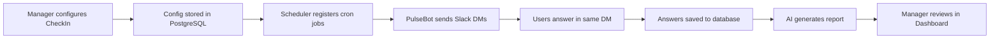
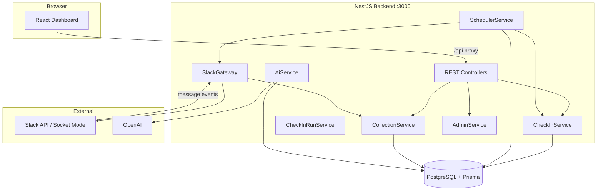
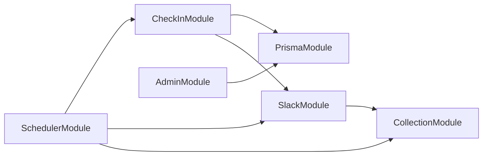
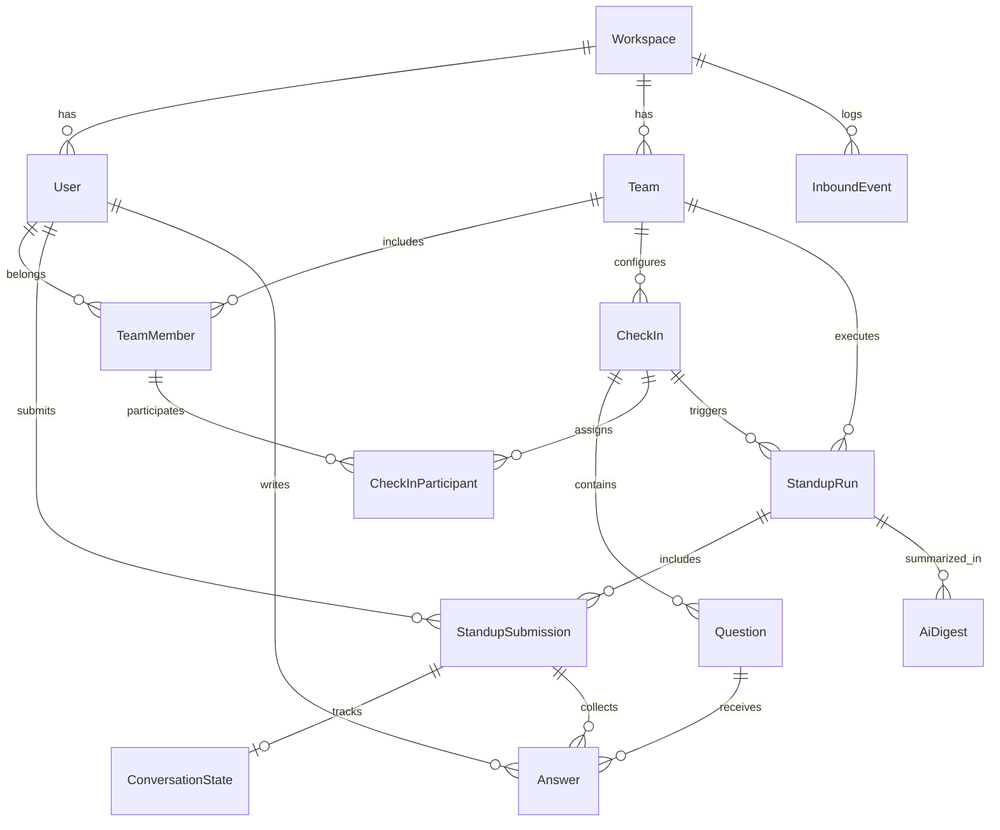
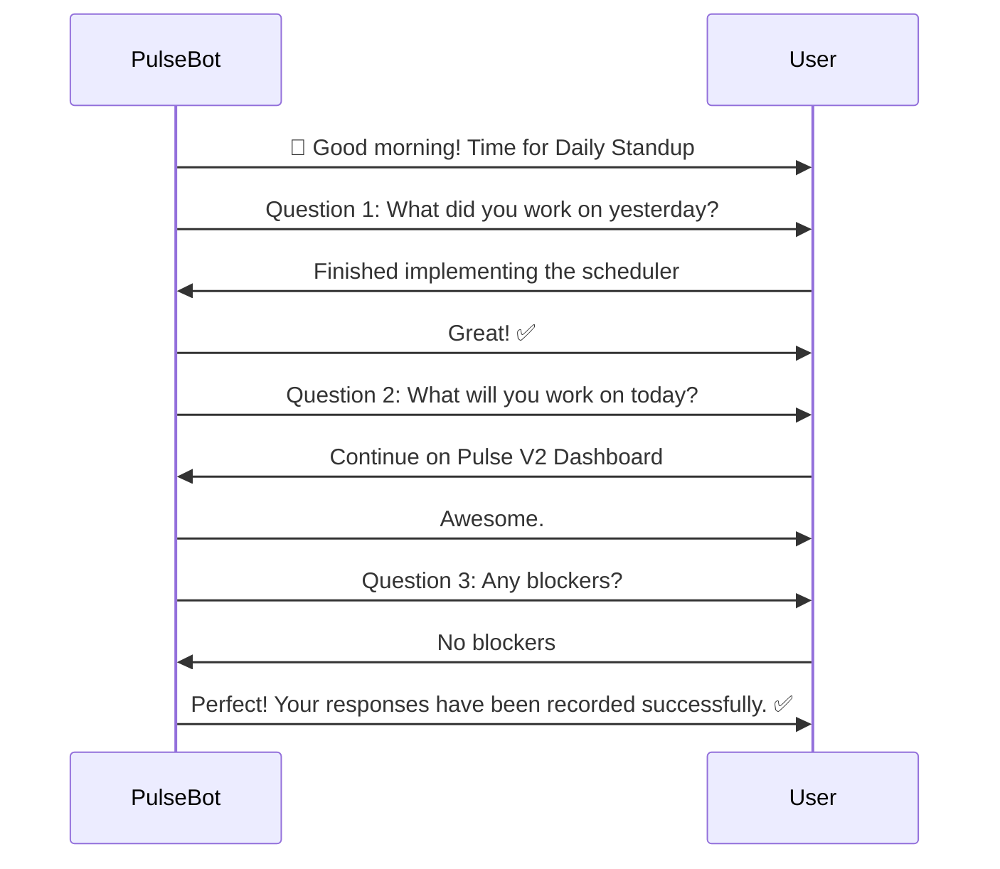
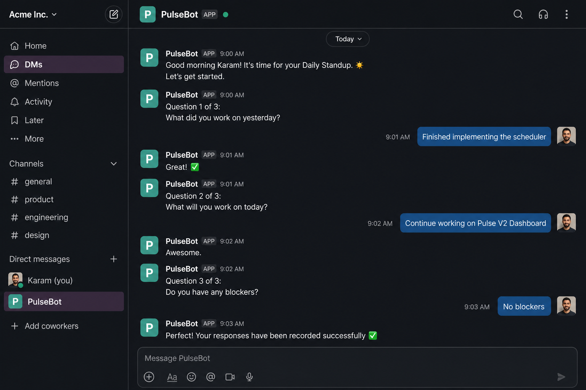
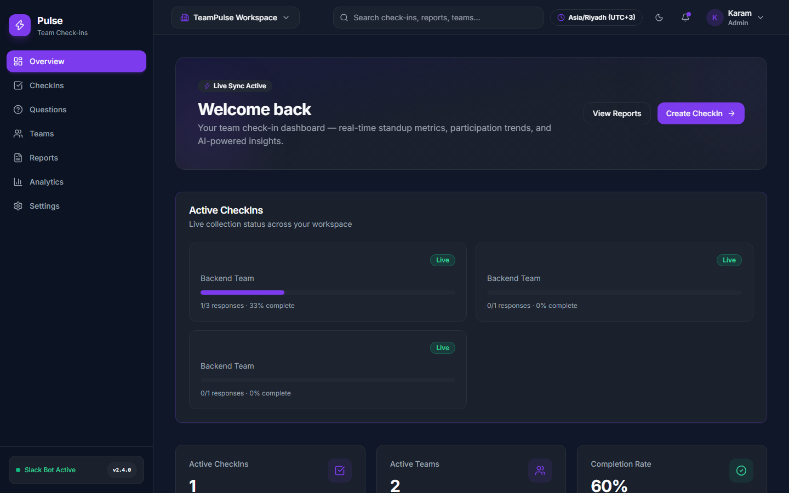
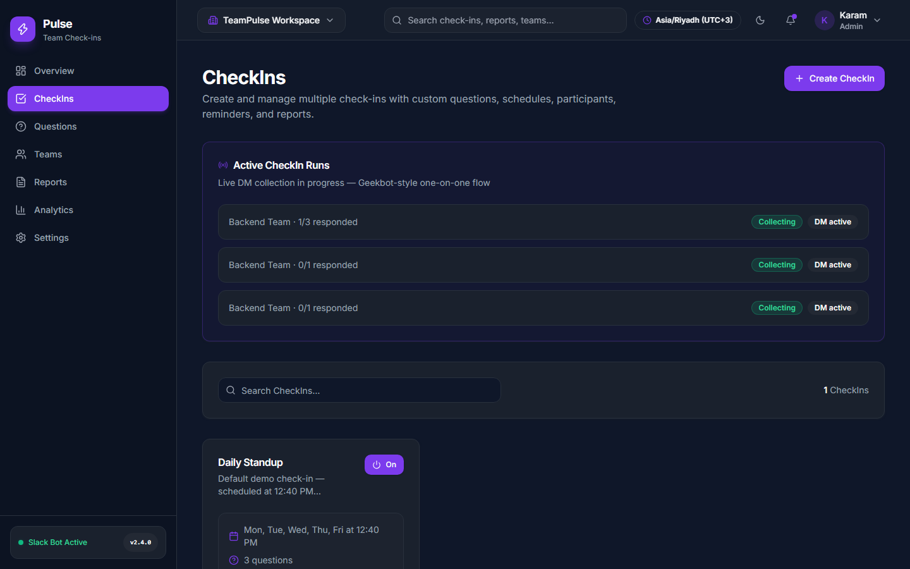
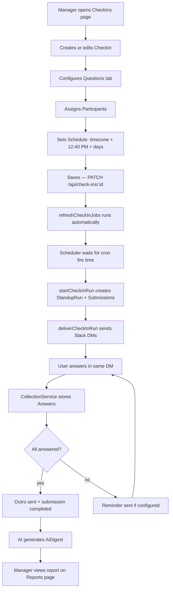

# Pulse V2 — Technical Documentation

**Version:** 2.4.0  
**Last updated:** August 11, 2026  
**Audience:** Developers, technical leads, and operators onboarding to Pulse V2

---

## Table of Contents

1. [Project Overview](#1-project-overview)
2. [System Architecture](#2-system-architecture)
3. [Database Design](#3-database-design)
4. [Slack Integration](#4-slack-integration)
5. [Dashboard](#5-dashboard)
6. [Features](#6-features)
7. [APIs](#7-apis)
8. [File Changes](#8-file-changes)
9. [UI Components](#9-ui-components)
10. [End-to-End Workflow](#10-end-to-end-workflow)
11. [Testing](#11-testing)
12. [Future Improvements](#12-future-improvements)

---

## 1. Project Overview

### Project purpose

**Pulse V2** is a production-ready, Geekbot-style asynchronous standup platform for Slack workspaces. It lets managers configure team check-ins from a web Dashboard — schedules, questions, participants, reminders, and reports — without editing code or redeploying the application.

Pulse replaces manual standup meetings with **scheduled Slack direct messages**. Each participant receives a personal DM, answers questions one at a time in the same conversation, and responses are stored for AI-generated team reports.

### Pulse V2 workflow



### Main objectives

| Objective | Implementation |
|-----------|----------------|
| Geekbot-style UX | One continuous DM per participant; intro → questions → acks → outro |
| Full Dashboard control | No hardcoded schedules; all config in PostgreSQL |
| Hot scheduler reload | Schedule changes apply immediately via `refreshCheckInJobs()` |
| Real data everywhere | Overview KPIs and charts query live PostgreSQL (no mock data) |
| Multi-CheckIn support | Teams can run multiple independent check-ins |
| Default demo CheckIn | Seeded at **12:40 PM Asia/Hebron** — editable from Dashboard |

---

## 2. System Architecture

### High-level diagram



### Frontend architecture

| Layer | Technology | Description |
|-------|------------|-------------|
| Framework | React 18 + TypeScript | Component-based UI |
| Build | Vite 4 | Dev server, HMR, production bundle |
| Routing | React Router v7 | Five dashboard routes |
| Styling | Tailwind CSS 3 + shadcn/ui | Dark SaaS theme |
| Charts | Recharts | Overview participation/trend charts |
| Drag-and-drop | @dnd-kit | Question reordering in CheckIn form |

**Dev proxy:** `frontend/vite.config.ts` forwards `/api/*` → `http://localhost:3000`.

### Backend architecture

| Module | Responsibility |
|--------|----------------|
| `CheckInModule` | CheckIn CRUD, runs, scheduler reconciliation |
| `SchedulerModule` | Cron registration, reminders, report triggers |
| `SlackModule` | Bolt app, Web API, DM delivery, inbound messages |
| `CollectionModule` | Conversation state, answer submission |
| `AdminModule` | Overview stats, teams, reports, settings |
| `AiModule` | Digest/summary generation |
| `ReportsModule` | CSV/text export |
| `PrismaModule` | Database access |

### Folder structure

```
pulse/
├── backend/
│   ├── prisma/
│   │   ├── schema.prisma      # Data models
│   │   └── seed.ts            # Default CheckIn + Slack sync
│   └── src/
│       ├── check-in/          # V2 CheckIn domain
│       ├── scheduler/         # Cron + reminders
│       ├── slack/             # Slack integration
│       ├── collection/        # Answer flow
│       ├── admin/             # Dashboard APIs
│       └── ai/                # Report generation
├── frontend/
│   └── src/
│       ├── app/App.tsx          # Routes
│       ├── layouts/             # Dashboard shell
│       ├── pages/               # Overview, CheckIns, Teams, Reports, Settings
│       └── components/          # UI + CheckIn builders
└── docs/
    ├── TECHNICAL_DOCUMENTATION.md
    ├── capture-screenshots.mjs
    └── screenshots/
```

### Module relationships



`CheckInService` uses `ModuleRef` to call `SchedulerService.refreshCheckInJobs()` after mutations, avoiding a constructor circular dependency with `SchedulerModule`.

### Data flow

1. **Configuration:** Dashboard → `PATCH /api/check-ins/:id` → PostgreSQL → scheduler refresh
2. **Collection:** Cron fires → `startCheckInRun()` → `deliverCheckInRun()` → Slack DM
3. **Answers:** Slack message → `SlackGateway` → `CollectionService.submitAnswer()` → PostgreSQL
4. **Reports:** Report cron or completion trigger → `AiService` → `AiDigest` → Dashboard Reports page

---

## 3. Database Design

### Entity relationship diagram



### Model reference

#### Workspace

Root tenant tied to one Slack workspace.

| Field | Purpose |
|-------|---------|
| `slackWorkspaceId` | Slack team ID (unique) |
| `botToken` | Bot OAuth token for API calls |
| `slackWorkspaceName` | Display name |

#### User

A Slack user mapped into Pulse.

| Field | Purpose |
|-------|---------|
| `slackUserId` | Slack user ID (unique) |
| `slackDisplayName` | Display name synced from Slack |
| `timezone` | Optional IANA timezone |

#### Team

Organizational unit within a workspace.

| Field | Purpose |
|-------|---------|
| `name` | Team name |
| `slackChannelId` | Optional default channel |
| `timezone` | Team default timezone |
| `schedulerEnabled` | Legacy team-level scheduler flag |

#### TeamMember

Join table between User and Team.

| Field | Purpose |
|-------|---------|
| `role` | `member`, `lead`, etc. |
| `optedOut` | Excludes user from collection when true |

#### CheckIn

Core V2 configuration entity.

| Field | Purpose |
|-------|---------|
| `collectionCron` | Cron expression for DM delivery |
| `timezone` | IANA timezone for cron interpretation |
| `introMessage` / `outroMessage` | DM bookends |
| `publishStatus` | `draft` or `published` |
| `scheduleEnabled` | Toggle automatic scheduling |
| `reminderEnabled`, `reminderMinutesAfter`, etc. | Reminder config |
| `updatesChannelId` | Slack channel for parent standup message and thread |
| `reportCron`, `reportTriggerMode` | Report config (report posts in same thread) |

**Default seed:** `40 12 * * 1-5` in `Asia/Hebron` (12:40 PM Mon–Fri).

#### CheckInParticipant

Links a TeamMember to a CheckIn.

#### Question

Belongs to a CheckIn. Types: `FREE_TEXT`, `NUMERICAL`, `YES_NO`, `YES_NO_MAYBE`, `MULTIPLE_CHOICE`, `SCALE_1_5`.

| Field | Purpose |
|-------|---------|
| `order` | Display sequence |
| `isRequired` | Validation flag |
| `isActive` | Enable/disable without delete |
| `options` | JSON array for multiple choice |

#### StandupRun

One occurrence of a CheckIn (scheduled or manual).

| Field | Purpose |
|-------|---------|
| `scheduledFor` | Occurrence timestamp (unique per CheckIn) |
| `triggerSource` | `scheduler` or `manual` |
| `status` | `collecting`, `completed`, etc. |
| `reminderDueAt` / `reminderSentAt` | Reminder lifecycle |
| `reportDueAt` / `reportGeneratedAt` | Report lifecycle |

#### StandupSubmission

One participant's session within a run.

| Field | Purpose |
|-------|---------|
| `status` | `pending`, `in_progress`, `completed` |
| `slackDmChannelId` | DM channel for reminders and continuity |

#### Answer

Stored response to a question.

| Field | Purpose |
|-------|---------|
| `text` | Raw answer text |
| `structuredValue` | Optional JSON for typed answers |

#### ConversationState

Tracks which question the user is on.

| Field | Purpose |
|-------|---------|
| `currentQuestionId` | Active question pointer |
| `isCompleted` | Whether conversation finished |

**Constraint:** Only one unfinished conversation per user at a time.

#### AiDigest

AI-generated report for a run.

| Field | Purpose |
|-------|---------|
| `summary` | Narrative summary |
| `blockers` | JSON array of blockers |
| `themes` | JSON array of themes |

#### InboundEvent

Idempotent log of inbound Slack events for reliability and debugging.

---

## 4. Slack Integration

### Workspace installation

1. Create a Slack App with Bot Token Scopes: `chat:write`, `im:write`, `users:read`, `users:read.email`
2. Enable **Socket Mode** (optional but recommended for inbound messages)
3. Set environment variables in `pulse/backend/.env`:

```env
SLACK_BOT_TOKEN=xoxb-...
SLACK_SIGNING_SECRET=...
SLACK_APP_TOKEN=xapp-...
SLACK_SOCKET_MODE_ENABLED=true
CHECKIN_SCHEDULER_ENABLED=true
DATABASE_URL=postgresql://...
```

4. Run `npm run seed` to sync workspace members and create the default CheckIn

### Slack authentication

- **Outbound:** `@slack/web-api` `WebClient` authenticated with `SLACK_BOT_TOKEN`
- **Inbound:** `@slack/bolt` Socket Mode listens for `message` events
- **User registration:** `SlackService.ensureUserRegistered()` upserts Workspace + User on first interaction

### Scheduler

- On startup (`SchedulerService.onModuleInit`), reads all CheckIns where `enabled=true`, `publishStatus=published`, `scheduleEnabled=true`
- Registers timezone-aware cron jobs: `checkin-collection-{id}` and `checkin-report-{id}`
- **Hot reload:** Any CheckIn mutation calls `refreshCheckInJobs()` — removes old jobs and re-reads PostgreSQL **without restarting NestJS**

### Direct Messages

`SlackGateway.deliverCheckInToParticipant()`:

1. `conversations.open({ users: slackUserId })`
2. Send intro message
3. Send Question 1
4. Save `slackDmChannelId` on submission

### Conversation flow



All messages use the **same DM channel ID**.

### Reminder flow

1. `StandupRun.reminderDueAt` set at run creation
2. Minute sweep queries overdue reminders
3. Reminder sent to `slackDmChannelId` with current question text
4. Respects `reminderOnlyNonResponders`

### Report flow

| Trigger | When |
|---------|------|
| `scheduled` | `reportCron` fires in CheckIn timezone |
| `all_answered` | All submissions complete |
| `timeout` | After `reportTimeoutMinutes` |

Report creates `AiDigest` and posts to the CheckIn run's Slack thread (`StandupRun.slackThreadTs`).

### Thread handling

Each CheckIn run gets **one dedicated Slack thread** in the updates channel:

1. Scheduler/manual trigger creates `StandupRun`
2. Bot posts parent message (title, date, progress) → stores `slackChannelId` + `slackThreadTs`
3. Participant summaries and AI reports are posted as thread replies
4. "Add Additional Update" button lives in the thread

Concurrent CheckIns are fully isolated — each run has its own `slackThreadTs`.

Collection still happens in **private DMs** (Geekbot-style). After all questions are answered, the bot posts a formatted summary into the run's thread.

### Why one continuous DM conversation

Geekbot's UX depends on a single personal conversation per check-in session. Users should not receive a new DM for each question. Pulse enforces:

- One DM channel per submission
- Sequential question delivery with brief acknowledgements
- Thread summaries posted after completion (not during Q&A)



---

## 5. Dashboard

The sidebar contains exactly five pages:

| Page | Route |
|------|-------|
| Overview | `/overview` |
| CheckIns | `/checkins` |
| Teams | `/teams` |
| Reports | `/reports` |
| Settings | `/settings` |

Analytics metrics (completion rate, pending responses, participation trends) are consolidated on **Overview** as KPI cards and charts — there is no separate Analytics page.

### Overview



**Purpose:** Executive command center and analytics summary.

**Features:**
- KPI cards: Active CheckIns, Active Teams, Completion Rate, Pending Responses, Today's Reports, Avg Response Time
- Weekly participation bar chart
- 7-day completion trend area chart
- Active run progress panel
- Recent activity timeline
- Upcoming scheduled CheckIns
- Top blockers from AI digests
- AI insights summary

**APIs:** `GET /api/admin/overview`, `GET /api/check-ins/runs/active`

---

### CheckIns



**Purpose:** Create and manage all CheckIn configurations.

**Features:**
- Searchable CheckIn grid
- Enable/disable, duplicate, delete, manual run
- Active runs panel (DM collection status)
- Tabbed create/edit dialog:
  - **General** — name, intro/outro, draft/publish
  - **Questions** — drag-and-drop builder with Slack preview
  - **Schedule** — 12-hour AM/PM picker, timezone, days
  - **Reminders** — timing, frequency, non-responder filter
  - **Reports** — trigger mode, channel, cron
  - **Participants** — team member picker


**APIs:** Full `/api/check-ins` CRUD + `POST /api/check-ins/:id/runs`

---

### Teams


**Purpose:** Manage teams and members.

**Features:**
- Team list with member counts
- Add/remove members
- Search members
- Update roles (member/lead)

**APIs:** `/api/admin/teams`, `/api/admin/teams/:teamId/members`

---

### Reports


**Purpose:** Browse AI-generated standup digests.

**Features:**
- Search and timeframe filter
- View summary, blockers, themes
- CSV and text export

**APIs:** `GET /api/admin/reports`, export endpoints

---

### Settings


**Purpose:** Workspace configuration and integration status.

**Features:**
- Slack connection status
- Scheduler enablement info
- General workspace preferences

**APIs:** `GET/PUT /api/admin/settings`

---

## 6. Features

### CheckIn Management

- Create, edit, delete, duplicate CheckIns
- Draft / published status
- Enable / disable CheckIn and schedule independently
- Per-CheckIn intro and outro messages
- Manual run with immediate DM delivery

### Question Management

- Managed inside CheckIn form (Questions tab)
- Drag-and-drop reorder
- Types: free text, numerical, yes/no, yes/no/maybe, multiple choice, 1–5 scale
- Required/optional and enable/disable toggles
- Duplicate questions
- Live Slack preview component

### Team Management

- Create/delete teams
- Add members by user search or Slack user ID
- Remove members, update roles
- Opt-out support via `TeamMember.optedOut`

### Scheduler

- Database-driven cron from `CheckIn.collectionCron` + `CheckIn.timezone`
- Hot reload on every CheckIn mutation
- Manual refresh: `POST /api/scheduler/refresh`
- Default demo: 12:40 PM Asia/Hebron (editable from Dashboard)

### Reminder System

- Configurable delay after run start
- Optional recurring reminders
- Non-responder-only filter
- Persistent DB-backed sweep (survives restarts)

### Slack Integration

- DM opening via Web API
- Socket Mode inbound message handling
- Display name sync
- Workspace member sync on seed

### Reports

- Scheduled, all-answered, and timeout triggers
- Dashboard list with search
- CSV/text export

### AI Report Generation

- OpenAI-powered digest from collected answers
- Blocker and theme extraction
- Stored in `AiDigest` model

### Workspace Settings

- Settings page for workspace-level config
- Environment-driven Slack and scheduler flags

### User Roles

- `TeamMember.role`: `member`, `lead` (extensible string)
- Team leads manageable from Teams page

### Conversation State Management

- One active unfinished conversation per user
- `ConversationState.currentQuestionId` advances on each answer
- Completion triggers outro message

### Run Lifecycle

```
scheduled/manual trigger → collecting → (all complete or timeout) → completed
```

### Submission Lifecycle

```
pending → in_progress (first answer) → completed (all questions answered)
```

---

## 7. APIs

Base URL: `http://localhost:3000/api`

### CheckIns

| Method | Route | Purpose | Request | Response |
|--------|-------|---------|---------|----------|
| POST | `/check-ins` | Create CheckIn | `CreateCheckInDto` | CheckIn with relations |
| GET | `/check-ins` | List CheckIns | `?teamId=` optional | CheckIn[] |
| GET | `/check-ins/runs/active` | Active runs | — | StandupRun[] |
| GET | `/check-ins/:id` | Get CheckIn | — | CheckIn |
| PATCH | `/check-ins/:id` | Update (+ scheduler refresh) | `UpdateCheckInDto` | CheckIn |
| PATCH | `/check-ins/:id/enabled` | Toggle enabled | `{ enabled: boolean }` | CheckIn |
| POST | `/check-ins/:id/runs` | Manual run + DMs | — | Run result |
| POST | `/check-ins/:id/duplicate` | Duplicate | — | New CheckIn |
| DELETE | `/check-ins/:id` | Delete | — | — |

### Admin

| Method | Route | Purpose |
|--------|-------|---------|
| GET | `/admin/overview` | Overview KPIs, charts, activity |
| GET | `/admin/reports` | List AI digests (`?search=&timeframe=`) |
| GET | `/admin/reports/:id/export/csv` | CSV export |
| GET | `/admin/reports/:id/export/pdf` | Text export |
| GET | `/admin/settings` | Workspace settings |
| PUT | `/admin/settings` | Update settings |
| GET | `/admin/teams` | List teams |
| POST | `/admin/teams` | Create team |
| DELETE | `/admin/teams/:id` | Delete team |
| GET | `/admin/users` | Search users |
| GET | `/admin/teams/:teamId/members` | Search members |
| POST | `/admin/teams/:teamId/members` | Add member |
| PATCH | `/admin/teams/:teamId/members/:memberId` | Update role |
| DELETE | `/admin/teams/:teamId/members/:memberId` | Remove member |

### Scheduler

| Method | Route | Purpose |
|--------|-------|---------|
| POST | `/scheduler/refresh` | Reload all CheckIn cron jobs from DB |
| POST | `/scheduler/check-ins/:checkInId/run-report` | Manually generate report |

### Legacy (V1)

| Method | Route | Purpose |
|--------|-------|---------|
| POST | `/scheduler/trigger-standup` | Legacy standup trigger |
| POST | `/scheduler/send-reminders` | Legacy reminders |
| GET | `/questions` | Legacy global questions |

---

## 8. File Changes

### Created

| File | Reason |
|------|--------|
| `frontend/src/components/checkins/*` | CheckIn form, question builder, schedule builder, Slack preview |
| `frontend/src/components/ui/*` | shadcn/ui component library |
| `frontend/src/lib/schedule.ts` | Cron ↔ 12h schedule conversion |
| `frontend/src/layouts/DashboardLayout.tsx` | Dashboard shell |
| `backend/prisma/seed.ts` (rewritten) | Default CheckIn + Slack member sync |
| `docs/TECHNICAL_DOCUMENTATION.md` | This document |
| `docs/capture-screenshots.mjs` | Screenshot automation |
| `docs/screenshots/*` | Dashboard and Slack flow images |

### Modified

| File | Reason |
|------|--------|
| `backend/prisma/schema.prisma` | V2 CheckIn models and fields |
| `backend/src/slack/slack.gateway.ts` | Geekbot DM delivery and answer flow |
| `backend/src/scheduler/scheduler.service.ts` | DB-driven cron, hot refresh |
| `backend/src/check-in/check-in.service.ts` | CRUD + scheduler reconciliation |
| `backend/src/check-in/check-in.controller.ts` | Manual run DM delivery |
| `backend/src/collection/collection.service.ts` | Conversation and answer handling |
| `backend/src/admin/admin.service.ts` | Real overview data queries |
| `frontend/src/pages/OverviewPage.tsx` | KPI summary (replaces Analytics page) |
| `frontend/src/pages/CheckInsPage.tsx` | V2 CheckIn management |
| `frontend/src/components/dashboard/AppSidebar.tsx` | Five-page navigation |

### Deleted

| File | Reason |
|------|--------|
| `frontend/src/pages/AnalyticsPage.tsx` | Analytics consolidated into Overview |
| `frontend/src/pages/QuestionsPage.tsx` | Questions managed inside CheckIn form |

---

## 9. UI Components

### Layouts

| Component | Path | Purpose |
|-----------|------|---------|
| `DashboardLayout` | `layouts/DashboardLayout.tsx` | Fixed sidebar + scrollable content area |
| `AppSidebar` | `components/dashboard/AppSidebar.tsx` | Five-item navigation |
| `TopNav` | `components/dashboard/TopNav.tsx` | Top bar with workspace context |

### Dashboard shared

| Component | Purpose |
|-----------|---------|
| `PageHeader` | Page title, description, action slot |
| `KpiCard` | Metric tile with icon |

### CheckIn-specific

| Component | Purpose |
|-----------|---------|
| `CheckInFormDialog` | Full CheckIn editor (6 tabs) |
| `QuestionBuilder` | Sortable question list with @dnd-kit |
| `ScheduleBuilder` | Day picker + 12h AM/PM time |
| `ParticipantPicker` | Multi-select team members |
| `SlackPreview` | Mock Slack DM preview |

### Reusable UI (shadcn/ui)

`Button`, `Card`, `Dialog`, `Tabs`, `Switch`, `Badge`, `Input`, `Textarea`, `Tooltip`, `Separator`, `Label`, `DropdownMenu`, `Avatar`, `Popover`

All use Tailwind + Radix primitives with the Pulse dark theme (`#0F172A` background, `#7C3AED` primary).

---

## 10. End-to-End Workflow



### Step detail

1. **Manager creates CheckIn** — name, team, publish status
2. **Configures questions** — order, types, required flags
3. **Assigns participants** — team members from synced Slack users
4. **Sets schedule** — e.g. Asia/Hebron, 12:40 PM, Mon–Fri → stored as `40 12 * * 1-5`
5. **Scheduler starts** — cron registered without app restart
6. **Slack DM sent** — intro + Question 1 to each participant
7. **User answers** — in the same DM; bot acks and sends next question
8. **Answers saved** — `Answer` rows linked to `StandupSubmission`
9. **Report generated** — AI digest on schedule or completion
10. **Manager reviews** — Reports page in Dashboard

---

## 11. Testing

### Backend

| Test | Method | Result |
|------|--------|--------|
| TypeScript compile | `npm run build` | ✅ Pass |
| Schema sync | `npx prisma db push` | ✅ Pass |
| Seed | `npm run seed` | ✅ Default CheckIn + 6 Slack members |
| Scheduler registration | Startup logs | ✅ Cron `40 12 * * 1-5` Asia/Hebron |

### Frontend

| Test | Method | Result |
|------|--------|--------|
| TypeScript + Vite build | `npm run build` | ✅ Pass |
| Route rendering | Playwright screenshots | ✅ All 5 pages |
| Analytics removal | Build + sidebar check | ✅ No Analytics route |

### Scheduler

| Test | Method | Result |
|------|--------|--------|
| Job registration | Backend logs on startup | ✅ Verified |
| Hot refresh | CheckIn PATCH → reconciliation log | ✅ Implemented |
| Manual run | `POST /check-ins/:id/runs` | ✅ Triggers DM delivery |

### Slack

| Test | Method | Result |
|------|--------|--------|
| Member sync | `npm run seed` with real token | ✅ 6 members synced |
| DM delivery | Manual run (recommended) | Requires live Slack test |
| Answer flow | Reply in DM (recommended) | Requires live Slack test |

### End-to-end (recommended manual checklist)

1. Start backend with `CHECKIN_SCHEDULER_ENABLED=true`
2. Open Dashboard → CheckIns → Play on Daily Standup
3. Confirm DM with intro + Question 1
4. Answer all questions → confirm outro
5. Change schedule in Dashboard → confirm scheduler reconciliation in logs
6. View report on Reports page after digest generation

### Regenerating screenshots

```bash
cd pulse/docs
node capture-screenshots.mjs
# Optional: PULSE_URL=http://localhost:5175 node capture-screenshots.mjs
```

---

## 12. Future Improvements

| Area | Enhancement |
|------|-------------|
| Reminders | Full recurring reminder intervals with configurable frequency |
| Reports | True PDF generation; richer report templates |
| Schedules | Multiple cron schedules per CheckIn |
| Auth | Complete Slack OAuth install flow in Settings UI |
| Exclusions | Exclude specific members UI in participant picker |
| Testing | Automated Playwright E2E suite in CI |
| Events | Webhook-based Slack events as Socket Mode alternative |
| Analytics | Optional embedded charts on Overview (no separate page) |

---

## Quick Start

```bash
# Backend
cd pulse/backend
npm install
npx prisma db push
npm run seed
CHECKIN_SCHEDULER_ENABLED=true npm run start:dev

# Frontend
cd pulse/frontend
npm install
npm run dev
# Open http://localhost:5173
```

---

*Pulse V2 Technical Documentation — end of document.*
